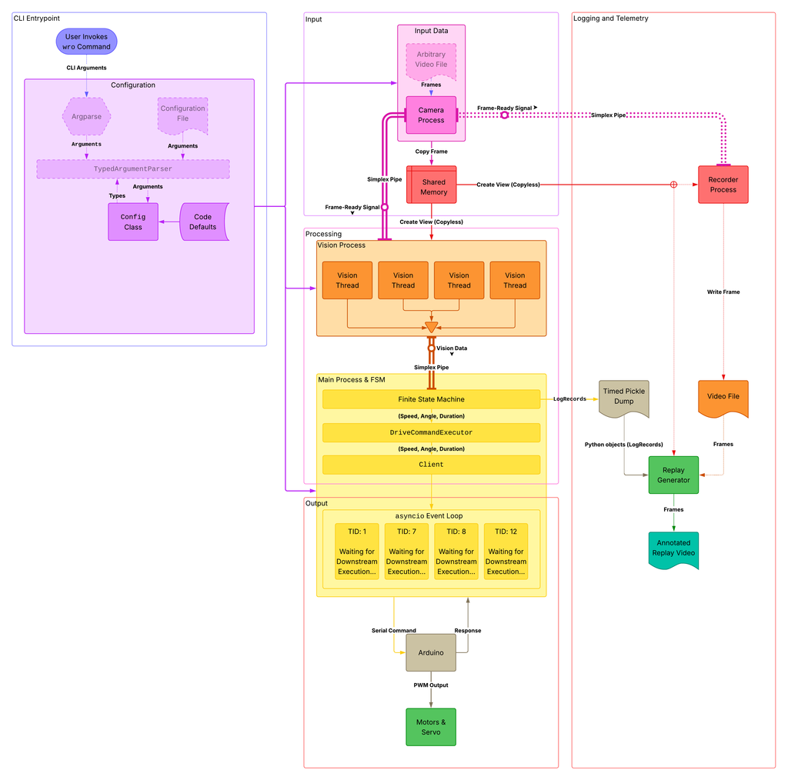

# WRO 2026 Future Engineers – TEAM APOSTLA

## Project Overview
This repository contains the complete documentation, code, design files, and test records for our **WRO 2026 Future Engineers** self-driving car project.

This repo is organized to show:
- how our robot is mechanically designed
- how power and sensors are arranged
- how the software is structured
- how engineering decisions were made
- how another team could reproduce the robot

---

## Team Information
- **Team Members:** Elvis Wang, Michael Xie, Ryan Rao
- **Coach / Mentor:** Huifei Rao

### *add more info about team and stuff*

---

## Robot Summary
Briefly describe your robot in 3–6 sentences.

Example:
> Our robot is a self-driving vehicle designed for the WRO 2026 Future Engineers challenge. It uses [camera / LiDAR / ultrasonic / IMU / other sensors] to detect the environment, follow the track, and react to obstacles. The robot is built with [main controller], [drive system], and [steering mechanism]. Our design focuses on [stability / reliability / fast turning / accurate detection / modularity].

### Main Features
- [Feature 1]
- [Feature 2]
- [Feature 3]
- [Feature 4]


---

## Repository Structure

### Main Files
- `README.md` – main project overview and navigation
- `LICENSE` – repository license
- `.gitignore` – ignored local/generated files
- `requirements.txt` – Python dependencies
- `CHANGELOG.md` – version history

### Documentation
- `docs/01_mechanical/` – mobility and mechanical design
- `docs/02_power_sensors/` – power system and sensor architecture
- `docs/03_software/` – software design and obstacle strategy
- `docs/04_systems_engineering/` – engineering decisions, trade-offs, and risks
- `docs/05_reproducibility/` – build, setup, assembly, and testing workflow

### Other Project Assets
- `cad/` – CAD models and mechanical design files
- `wiring/` – wiring diagrams and connector information
- `src/` – source code
- `tests/` – testing scripts, procedures, and logs
- `data/` – calibration data and experiment results
- `media/` – photos, screenshots, and videos
- `submissions/` – final competition submission materials

---

# 1. Mechanical Design
This section explains the physical design of the robot, including chassis layout, steering, drivetrain, torque/speed reasoning, and mechanical improvements over time.

- **Dimentions**: 24cm length 10cm wide 28cm high
    - [Dimentions reasoning](docs/01_mechanical/mechanical_reasoning.md#size-reasoning)
- **Drive Motor**: Furitek Micro Komodo 1212 Stepper Motor
    - [Motor reasoning](docs/01_mechanical/mechanical_reasoning.md#motor-selectionmotor-selection)
- **Steering Motor**: HS-5055MG 11.9g Metal Gear Digital Micro Servo
    - [Steering reasoning](docs/01_mechanical/mechanical_reasoning.md#servo-motor)

### Images of Robot
| | |
|:---:|:---:|
|  |  |
|  |  |
|  |  |

*Placeholder images*

---

- **Drive System**: We use rear wheel drive, means the motor's power is transmitted to the back wheels rather than the front.
    - [Why RWD?](docs/01_mechanical/mechanical_reasoning.md#drive-system)

### Structural Design
To get our current design, we took inspiration from our previous robot we used last year in Future Engineers.

#### Improvements
- Make the robot thinner for more clearence and better weight distribution
- More supports on the sides of the robot (we only had 2)


*add old robot photo*

---

#### Changes
- Rotating the Raspiberry Pi 90 degrees would allow for a slimmer design
- Implimenting more supports on the sides of the robot
- Created our own differential gear
- We use the Arduino Uno instead of Hiwonder
- Changed the camera angle and added a place for the stepdown voltage


*add new robot photo*

---

# 2. Power and Sensor Architecture
This section explains how the robot is powered, what sensors are used, where they are placed, and how they are calibrated.

### Files
- [`docs/02_power_sensors/power_architecture.md`](docs/02_power_sensors/power_architecture.md)
- [`docs/02_power_sensors/sensor_selection.md`](docs/02_power_sensors/sensor_selection.md)
- [`docs/02_power_sensors/sensor_placement.md`](docs/02_power_sensors/sensor_placement.md)
- [`docs/02_power_sensors/calibration.md`](docs/02_power_sensors/calibration.md)
- [`docs/02_power_sensors/wiring.md`](docs/02_power_sensors/wiring.md)

---

### Power

- **Battery**: Gens Ace 1300mAh 2S LiPo, 7.4V nominal, 45C discharge
    - [Battery details](docs/02_power_sensors/power_architecture.md#battery)
- **Voltage Regulation**: Step-down buck regulator converts 7.4V to 5V for the Raspberry Pi; ESC built-in BEC powers the servo independently
    - [Regulator details](docs/02_power_sensors/power_architecture.md#design-rationale)
- **Main Power Switch**: Smaller switch installed on the main battery rail after the original 20A switch was replaced for easier integration
    - [Power design](docs/02_power_sensors/power_architecture.md#iterations)
- **Estimated Runtime**: ~17 minutes at average load; enough for ~5 full competition runs per charge
    - [Runtime details](docs/02_power_sensors/power_architecture.md#runtime-considerations)

---

### Sensors

- **Camera (OV5647)**: Detects walls, corner lines, and colored pillars via CSI-2 at 640x480 up to 62.50 fps
    - [Camera selection](docs/02_power_sensors/sensor_selection.md#camera--ov5647)
- **LiDAR (LD19)**: 360-degree distance measurements for wall and obstacle detection over USB serial. Not yet integrated into the challenge runners.
    - [LiDAR selection](docs/02_power_sensors/sensor_selection.md#lidar--ld19)

---

### Compute

- **Raspberry Pi 5 (8GB)**: Main compute unit running the vision pipeline, control loop, and Arduino communication
    - [Raspberry Pi details](docs/02_power_sensors/sensor_selection.md#raspberry-pi-5-8gb)
- **Arduino Uno R3**: Handles PWM output to ESC and servo; receives drive commands from the Pi over USB serial
    - [Arduino details](docs/02_power_sensors/sensor_selection.md#arduino-uno-r3)

---

### Summary
- battery: Gens Ace 1300mAh 2S LiPo (7.4V, 45C)
- voltage regulation: Buck regulator for Pi (5V); ESC BEC for servo
- main sensors: OV5647 camera (CSI-2), LD19 LiDAR (USB serial)
- sensor placement strategy: Camera mounted at front with downward tilt for field of view; LiDAR mounted on top for 360-degree wall detection
- calibration approach: HSV color thresholds tuned under competition lighting using interactive tuning tools in `utils/`

---

# 3. Software Architecture and Strategy

# Software

This section explains the software that runs on the Raspberry Pi, including how the processes are structured, how the robot detects walls and obstacles, and how drive commands are sent to the Arduino.

---

## Architecture

Three processes run at the same time, camera, vision, and main control. The camera writes frames into shared memory, the vision process reads them and finds walls and obstacles, and the main process runs the state machine and sends commands to the Arduino. The system always uses the freshest data; stale frames and commands are dropped automatically.

- **Camera Process**: Captures frames and writes them into shared memory
    - [Architecture details](docs/03_software/architecture.md)
- **Vision Process**: Reads frames and finds walls and obstacles
    - [Vision details](docs/03_software/vision.md)
- **Main Process**: Runs the state machine and sends drive commands to the Arduino
    - [Runner details](docs/03_software/challenge_running.md)

<p align="center">
  
</p>
<p align="center"><i>Full software architecture diagram.</i></p>

---

## Config

All settings are stored in `piclient.toml`. Nothing is hardcoded — speed, PD gains, HSV thresholds, serial ports, and ROI sizes are all in the config file. Once the robot starts, the config is locked and cannot be changed mid-run.

- **Settings file**: `piclient.toml` at the root of the repo
    - [Config details](docs/03_software/config.md)
- **Override priority**: CLI flag > environment variable > piclient.toml > code defaults

---

## Vision

- **Open Challenge**: Counts black pixels in left, right, and center regions. More black pixels means the wall is closer. Corner detection triggers when the center region fills up.
    - [Open challenge vision details](docs/03_software/vision.md#open-challenge)
- **Obstacle Challenge**: Finds red and green pillars using HSV color detection and calculates the gap between each pillar and the nearby wall. The midpoint of that gap becomes the steering target.
    - [Obstacle challenge vision details](docs/03_software/vision.md#obstacle-challenge)

---

## Hardware Interfaces

- **Camera**: Runs in its own process, writes frames directly into shared memory with no copying
    - [Camera details](docs/03_software/hardware_interfaces.md#camera)
- **Arduino Client**: Sends serial commands with transaction IDs so multiple commands can be in flight at once
    - [Arduino client details](docs/03_software/hardware_interfaces.md#arduino-client)
- **DriveCommandExecutor**: Sits between the control loop and the Arduino — only the latest command is sent, stale commands are thrown away
    - [DriveCommandExecutor details](docs/03_software/hardware_interfaces.md#drivecommandexecutor)
- **LiDAR**: Wired up and parses data but not yet connected to either challenge runner
    - [LiDAR details](docs/03_software/hardware_interfaces.md#lidar)

---

## Challenge Running

### Open Challenge

| State | Trigger | Action |
|-------|---------|--------|
| Straight | Default | Wall follow with PD controller |
| Turn | Black fill detected ahead | Hard steer toward missing wall |
| Final Turn | Last turn of last lap | Same as Turn |
| Final Straight | After final turn | Drive to stop |

- [Open challenge runner details](docs/software/runners.md#open-challenge)

### Obstacle Challenge

Same as the open challenge with one extra state. When a pillar is detected, the robot steers toward the gap between the pillar and the wall. Green pillars are passed on the left, red on the right.

- [Obstacle challenge runner details](docs/software/runners.md#obstacle-challenge)

---

## Running the Robot

```bash
wro --GeneralConfig.CHALLENGE open
wro --GeneralConfig.CHALLENGE obstacle
```

Full auto-generated API docs: https://apostla-api-reference.web.app/
---

# 4. Systems Engineering and Design Decisions
This section explains how the robot was developed as an integrated system and how trade-offs were evaluated.

### Files
- [`docs/04_systems_engineering/subsystem_interactions.md`](docs/04_systems_engineering/subsystem_interactions.md)
- [`docs/04_systems_engineering/engineering_decisions.md`](docs/04_systems_engineering/engineering_decisions.md)
- [`docs/04_systems_engineering/constraints_tradeoffs.md`](docs/04_systems_engineering/constraints_tradeoffs.md)
- [`docs/04_systems_engineering/risk_analysis.md`](docs/04_systems_engineering/risk_analysis.md)
- [`docs/04_systems_engineering/iteration_cycles.md`](docs/04_systems_engineering/iteration_cycles.md)

### Summary
Write a short summary here:
- biggest engineering constraints:
- main trade-offs:
- most important decisions:
- major risks:
- how the robot improved through iteration:

---

# 5. Reproducibility
This section explains how another team could rebuild, set up, and test the robot.

### Files
- [`docs/05_reproducibility/build_guide.md`](docs/05_reproducibility/build_guide.md)
- [`docs/05_reproducibility/bill_of_materials.md`](docs/05_reproducibility/bill_of_materials.md)
- [`docs/05_reproducibility/assembly_steps.md`](docs/05_reproducibility/assembly_steps.md)
- [`docs/05_reproducibility/setup_guide.md`](docs/05_reproducibility/setup_guide.md)
- [`docs/05_reproducibility/testing_workflow.md`](docs/05_reproducibility/testing_workflow.md)
- [`docs/05_reproducibility/release_notes.md`](docs/05_reproducibility/release_notes.md)

### Summary
Write a short summary here:
- how to build the robot:
- how to install software:
- how to calibrate:
- how to test:
- what files are needed to reproduce the system:

---

## Hardware Summary
Fill in this quick-reference hardware list.

| Component | Model / Part | Purpose |
|----------|---------------|---------|
| Main controller |  |  |
| Secondary controller |  |  |
| Drive motor |  |  |
| Steering servo |  |  |
| Motor driver / ESC |  |  |
| Camera |  |  |
| LiDAR / distance sensor |  |  |
| IMU |  |  |
| Battery |  |  |
| Voltage regulator / BEC |  |  |

---

## Software Summary
Fill in this quick-reference software list.

| Item | Description |
|------|-------------|
| Main language |  |
| Main controller software |  |
| Secondary controller software |  |
| Main control loop |  |
| Perception method |  |
| Planning method |  |
| Steering control method |  |
| Speed control method |  |

---

## Build and Setup Quick Start
Give a short version here, and keep the detailed steps in `docs/05_reproducibility/`.

1. Build the chassis
2. Mount electronics
3. Connect wiring
4. Install software dependencies
5. Upload or run code
6. Calibrate sensors
7. Run tests

Detailed instructions:
- [`docs/05_reproducibility/build_guide.md`](docs/05_reproducibility/build_guide.md)
- [`docs/05_reproducibility/setup_guide.md`](docs/05_reproducibility/setup_guide.md)

---

## Testing and Validation
Summarize how the robot was tested.

Example points:
- bench tests for hardware
- sensor tests
- steering tests
- lane following tests
- obstacle avoidance tests
- full track tests

Detailed records:
- `tests/`
- `data/`
- [`docs/03_software/tuning_validation.md`](docs/03_software/tuning_validation.md)
- [`docs/04_systems_engineering/iteration_cycles.md`](docs/04_systems_engineering/iteration_cycles.md)

---

## Media and Visual Documentation
Use this section to point judges to photos, diagrams, and videos.

### Photos
- overall robot:
- front view:
- top view:
- sensor placement:
- wiring overview:

### Diagrams
- chassis diagram:
- power diagram:
- wiring diagram:
- software flowchart:
- state machine diagram:

### Videos
- robot demo:
- obstacle handling demo:
- testing clips:

Suggested folders:
- `media/`
- `docs/images/`
- `docs/diagrams/`
- `docs/videos/`

---

## CAD and Wiring Files
- `cad/` – CAD files and exports
- `wiring/` – wiring diagrams and connection references

Brief notes:
- CAD software used:
- file format(s):
- wiring diagram tool used:

---

## Version History
Briefly summarize major milestones here.

See full details in:
- [`CHANGELOG.md`](CHANGELOG.md)
- [`docs/05_reproducibility/release_notes.md`](docs/05_reproducibility/release_notes.md)

Example:
- **v0.1** – initial repo structure
- **v0.2** – first rolling prototype
- **v0.3** – improved steering and sensor placement
- **v0.4** – implemented lane following and obstacle response

---

## Contribution and Documentation Rules
Use this section to keep the repo organized.

Example:
- use clear commit messages
- add photos when mechanical changes are made
- document sensor changes in `sensor_placement.md`
- document tuning changes in `tuning_validation.md`
- document major engineering decisions in `engineering_decisions.md`

---

## Final Notes
This repository is intended to document not only the final robot, but also the engineering process behind it:
- design choices
- testing evidence
- failures and improvements
- reproducibility

The goal is to make the project understandable, traceable, and reproducible.
