# WRO 2026 Future Engineers – TEAM APOSTLA

## Project Overview
This repository contains the complete documentation, code, design files, and test records for our **WRO 2026 Future Engineers** self-driving car project.

This repo is organized to show:
- how our robot is mechanically designed
- how power and sensors are arranged
- how the software is structured
- how engineering decisions were made
- how another team could reproduce the robot

---

## Team Members

<p align="center">
  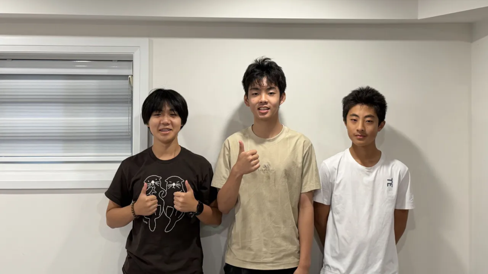
</p>
<p align="center"><i>Explorer Robotics — WRO Future Engineers 2026</i></p>

---

We are a three-person team from Explorer Robotics in Whitby, Ontario, Canada. We have been competing in WRO for several years. This year we set out to build a fully autonomous self-driving robot from scratch, designing our own chassis, differential gear system, and vision pipeline.

<p align="center">
  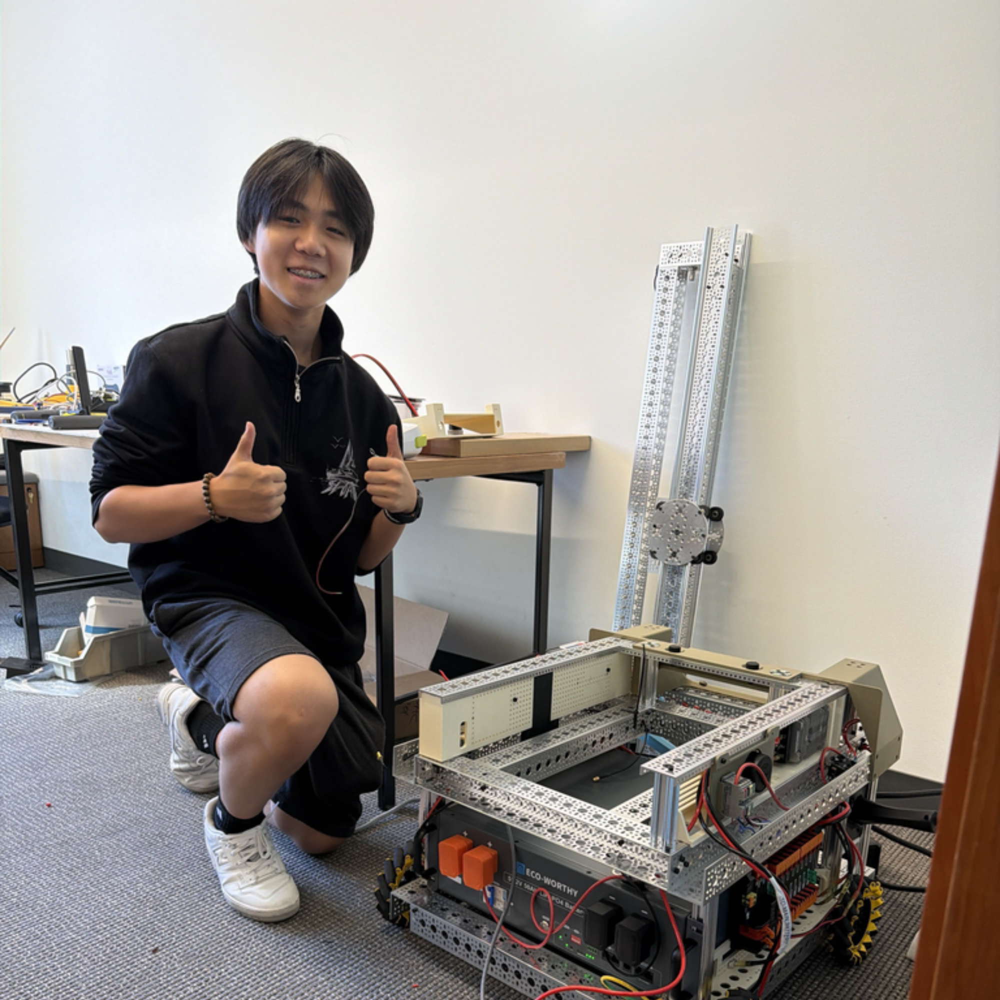
  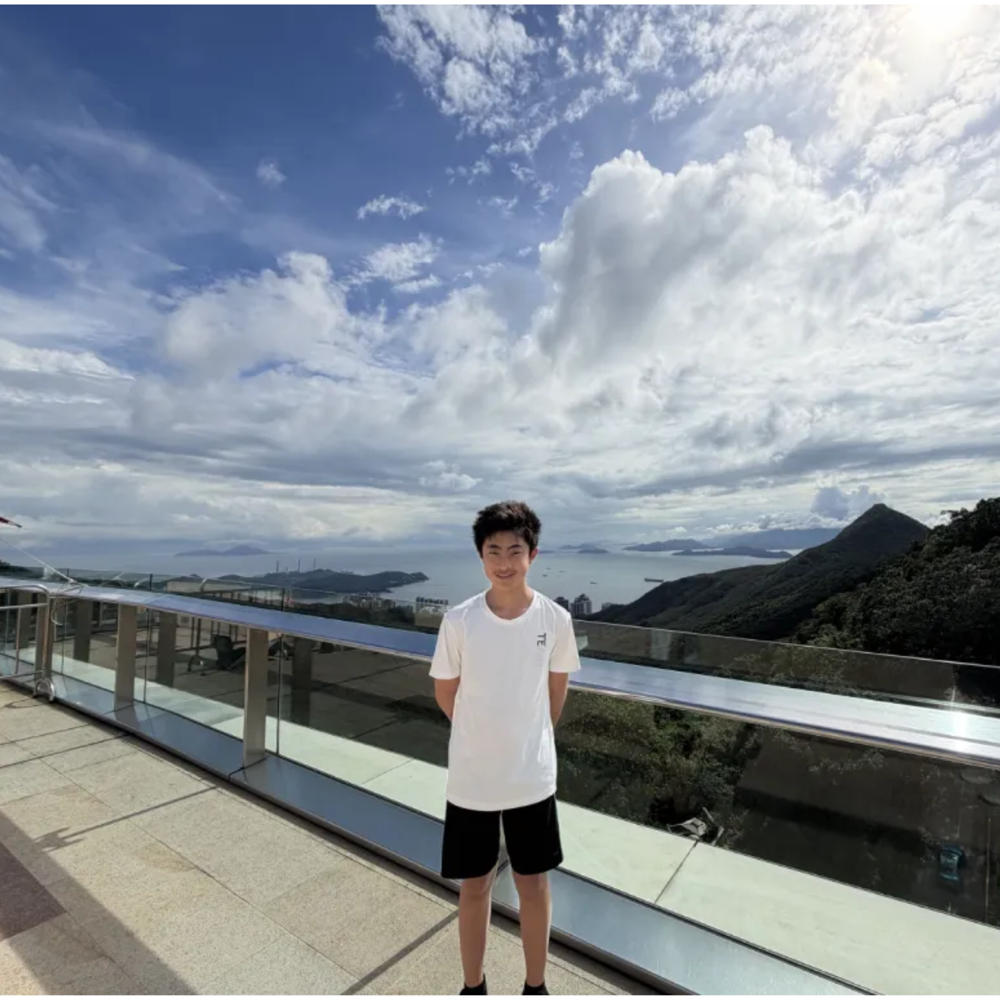
  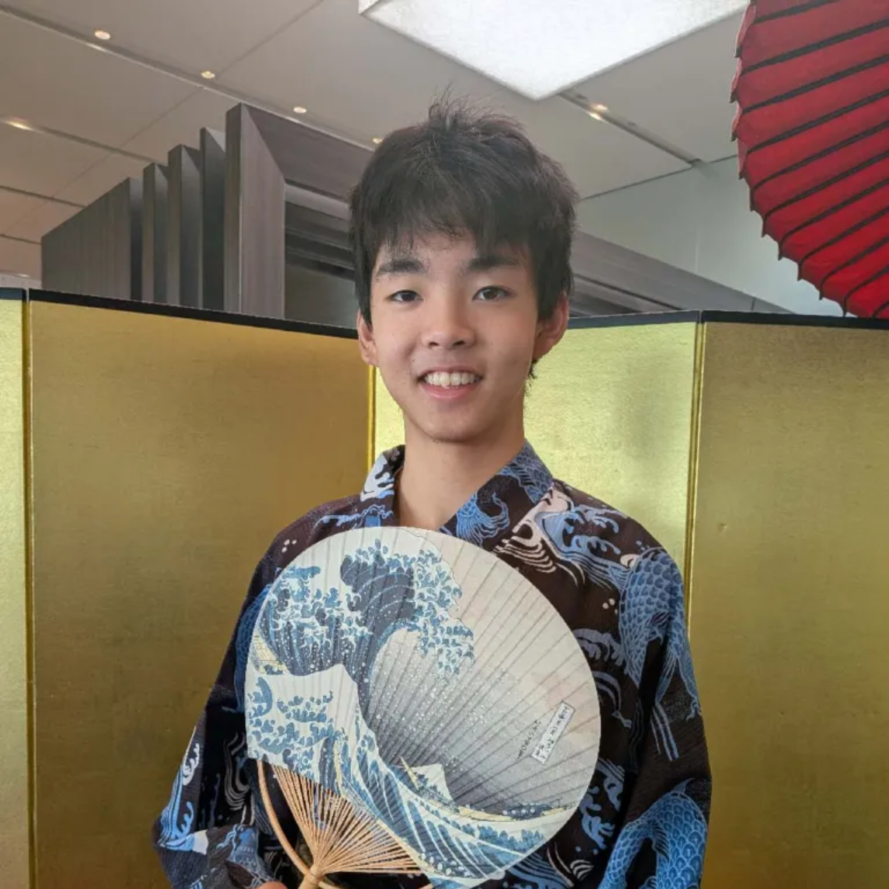
</p>
<p align="center">Elvis &nbsp;&nbsp;&nbsp; Michael &nbsp;&nbsp;&nbsp; Ryan</p>

## Our Coach
<table>
<tr>
  <td align="center" width="40%">
    <br>
    <em>Our Coach</em>
  </td>

  <td valign="top" width="60%">
  


  ### Information
  - Head coach of Robotics Competitions, including FLL (First LEGO League),  WRO (World Robotics Olympiad) Robo Sports, Future Engineers, and Robo Mission. Led teams in winning multiple national, international robotics, and programming awards.
  - Over 20 years of IT industry experience as a software engineer working internationally.
  - MSc in Electrical & Computer Engineering from the University of Alberta.
  - BSc in Mathematics from Peking University.
  - Founder of Explorer Robotics, a local robotics club in Ajax and Whitby, teaching coding, AI, robotics, etc.
  </td>
</tr>
</table>

[](https://explorer-robotics.com/)

---

## Robot Summary

> Our robot is a self-driving car built for the WRO 2026 Future Engineers challenge. It uses one downward-angled camera to spot track walls, corner lines, and colored obstacle pillars, and follows the track using a state-machine control loop. The robot runs on a Raspberry Pi 5 for vision, an Arduino Uno for motor and servo control, a Furitek Micro Komodo 1212 brushless motor that drives the rear wheels through a differential gearbox, and rack-and-pinion steering run by an HS-5055MG servo. Our design is simple and reliable, using one sensor for all detection and a sturdy build that's easy to fix during competition.

---

## Table of Contents

- [Project Overview](#project-overview)
- [Team Members](#team-members)
- [Robot Summary](#robot-summary)
- [Repository Structure](#repository-structure)
  - [Main Files](#main-files)
  - [Documentation](#documentation)
  - [Other Project Assets](#other-project-assets)
- [1. Mechanical Design](#1-mechanical-design)
  - [Images of Robot](#images-of-robot)
  - [Structural Design](#structural-design)
    - [Old Design](#old-design)
    - [Improvements](#improvements)
    - [Changes](#changes)
  - [3D Printed Parts](#3d-printed-parts)
  - [Full Robot](#full-robot)
- [2. Power and Sensor Architecture](#2-power-and-sensor-architecture)
  - [Files](#files)
  - [Power](#power)
  - [Voltage and Current Requirements](#voltage-and-current-requirements)
    - [5V Rail (Raspberry Pi, Arduino, Servo)](#5v-rail-raspberry-pi-arduino-servo)
    - [7.4V Rail (Motor)](#74v-rail-motor)
    - [Total Battery Power and Current](#total-battery-power-and-current)
    - [Runtime Estimate](#runtime-estimate)
  - [Sensors](#sensors)
  - [Compute](#compute)
  - [Summary](#summary)
- [3. Software Architecture and Strategy](#3-software-architecture-and-strategy)
  - [Software](#software)
  - [Architecture](#architecture)
  - [Config](#config)
  - [Vision](#vision)
    - [Wall Following](#wall-following)
    - [Obstacle Detection](#obstacle-detection)
  - [Hardware Interfaces](#hardware-interfaces)
  - [Challenge Running](#challenge-running)
    - [Open Challenge](#open-challenge)
    - [Obstacle Challenge](#obstacle-challenge)
  - [Running the Robot](#running-the-robot)
- [4. Systems Engineering and Design Decisions](#4-systems-engineering-and-design-decisions)
  - [Files](#files-1)
  - [Constraints](#constraints)
  - [Trade-offs](#trade-offs)
  - [Design Iteration](#design-iteration)
  - [Risk Analysis](#risk-analysis)
  - [Subsystem Interactions](#subsystem-interactions)
  - [Summary](#summary-1)
- [5. Reproducibility](#5-reproducibility)
  - [Files](#files-2)
  - [Software Setup](#software-setup)
  - [Hardware Setup](#hardware-setup)
  - [Testing](#testing)
  - [Summary](#summary-2)
- [Testing and Validation](#testing-and-validation)
- [Media and Visual Documentation](#media-and-visual-documentation)
  - [Diagrams](#diagrams)
  - [Videos](#videos)
- [CAD and Wiring Files](#cad-and-wiring-files)
- [Version History](#version-history)
- [Contribution and Documentation Rules](#contribution-and-documentation-rules)
- [Final Notes](#final-notes)

---

## Repository Structure

### Main Files
- `README.md` – main project overview and navigation
- `LICENSE` – repository license
- `.gitignore` – ignored local/generated files
- `requirements.txt` – Python dependencies


### Documentation
- `docs/01_mechanical/` – mobility and mechanical design
- `docs/02_power_sensors/` – power system and sensor architecture
- `docs/03_software/` – software design and obstacle strategy
- `docs/04_systems_engineering/` – engineering decisions, trade-offs, and risks
- `docs/05_reproducibility/` – build, setup, assembly, and testing workflow
- `docs/journal/` – dated engineering journal (Markdown + PDF export)
- `docs/img/` – images referenced throughout the docs (robot photos, diagrams, team photos)
- `docs/plan.md`, `docs/shoppingList.md`, `docs/coach_comments.md` – supporting planning docs

**Other top-level folders:**
- `ArudinoServer/` – PlatformIO firmware for the Arduino (low-level motor/servo control)
- `PiClient/` – Python code on the Raspberry Pi
    - `src/` – main vision processing, control, and Arduino communication logic
    - `src_min/` – a minimal/leaner variant of the same modules
    - `utils/tools/` – standalone calibration and debug tools (contours, lidar, manual control)
    - `tests/` – test and experiment scripts
- `EDA/` – KiCad PCB project (schematic, layout, project files)
    - `FAB/` – fabrication outputs (Gerbers, BOM, pick-and-place positions)
    - `lib/` – imported component symbol/footprint libraries


---

# 1. Mechanical Design
This section explains the physical design of the robot, including chassis layout, steering, drivetrain, torque/speed reasoning, and mechanical improvements over time.

- **Dimentions**: 24cm length 10cm wide 28cm high
    - [Dimentions reasoning](docs/01_mechanical/mechanical_reasoning.md#size-reasoning)
- **Drive Motor**: Furitek Micro Komodo 1212 Stepper Motor
    - [Motor reasoning](docs/01_mechanical/mechanical_reasoning.md#motor-selectionmotor-selection)
- **Steering Motor**: HS-5055MG 11.9g Metal Gear Digital Micro Servo
    - [Steering reasoning](docs/01_mechanical/mechanical_reasoning.md#servo-motor)

### Images of Robot
| | |
|:---:|:---:|
|  |  |
|  |  |
|  |  |


---

- **Drive System**: We use rear wheel drive, means the motor's power is transmitted to the back wheels rather than the front.
    - [Why RWD?](docs/01_mechanical/mechanical_reasoning.md#drive-system)
- **Steering type:** Parallel (Zero-Ackermann), Both front wheels turn at the same angle instead of the inner wheel turning more sharply than the outer. It does cause slight tire scrub during turns but it is acceptable on a small lightweight robot on a smooth mat.
    - [Why Parallel Zero-Ackermann?](docs/01_mechanical/mechanical_reasoning.md#steering-system)
### Structural Design
To get our current design, we took inspiration from our previous robot we used last year in Future Engineers.


#### Old Design
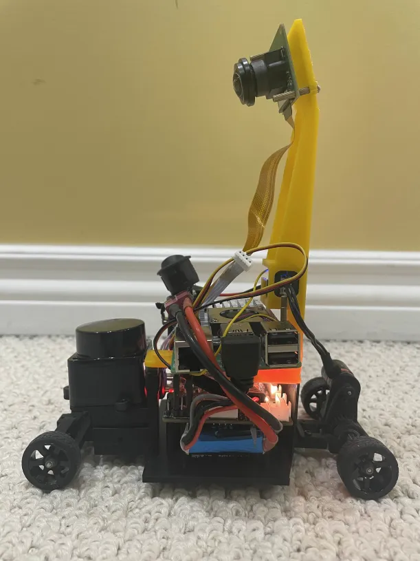


#### Improvements
- Make the robot thinner for more clearence and better weight distribution
- More supports on the sides of the robot (we only had 2)


---

#### Changes
- Rotating the Raspiberry Pi 90 degrees would allow for a slimmer design
- Implimenting more supports on the sides of the robot
- We use the Arduino Uno instead of Hiwonder
- Changed the camera angle and added a place for the stepdown voltage


### 3D Printed Parts

- **Turning System**: Servo-actuated rack and pinion steering with a curved front bumper for wall sliding in the obstacle challenge. The servo connects to the steering rack via a servo horn and tie rods, rotating the servo horn pushes or pulls the tie rods, which turn the front wheels left or right.
    - [Turning system iterations](docs/01_mechanical/mechanical_iterations.md#turning-system)

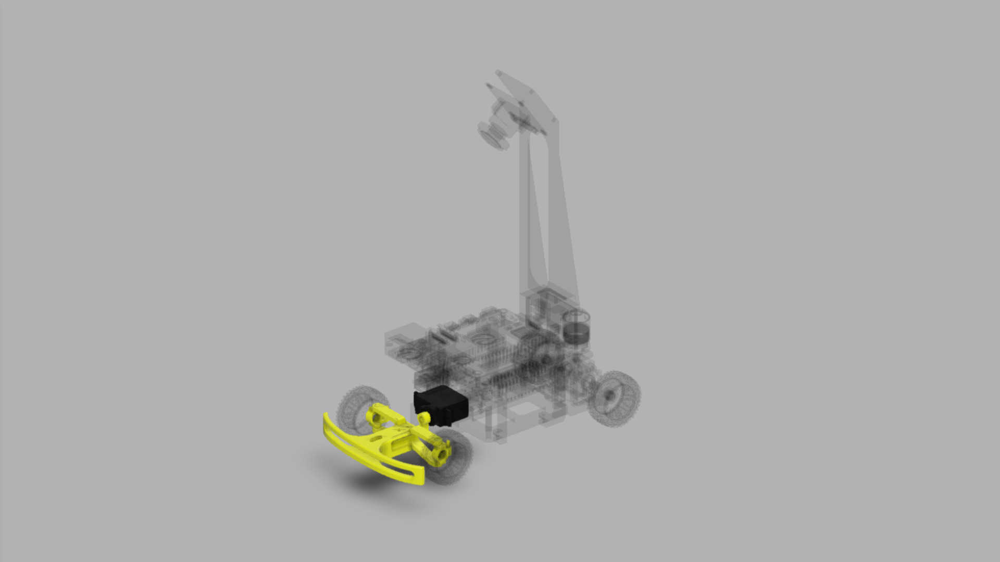

- **Raspberry Pi 5 Layout, Camera Mount, and ESC**: Slim rotated design with a separated camera tower angled at 35 degrees downward. The ESC is mounted inside the same assembly to keep electronics consolidated.
    - [RP5 layout and camera mount iterations](docs/01_mechanical/mechanical_iterations.md#raspberry-pi-5-layout-and-camera-mount)

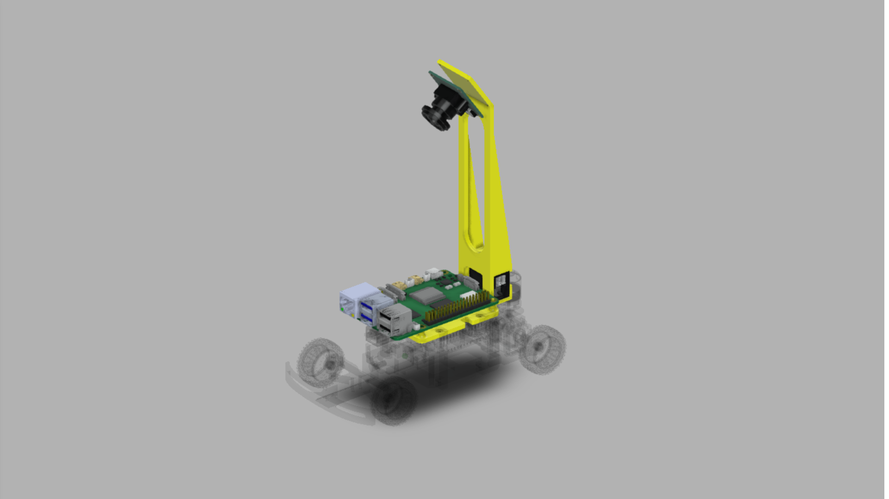

- **Arduino Uno Layout**: Main chassis plate holding the Arduino, servo, and front assembly; redesigned for compactness across three versions
    - [Arduino layout iterations](docs/01_mechanical/mechanical_iterations.md#arduino-uno-layout)

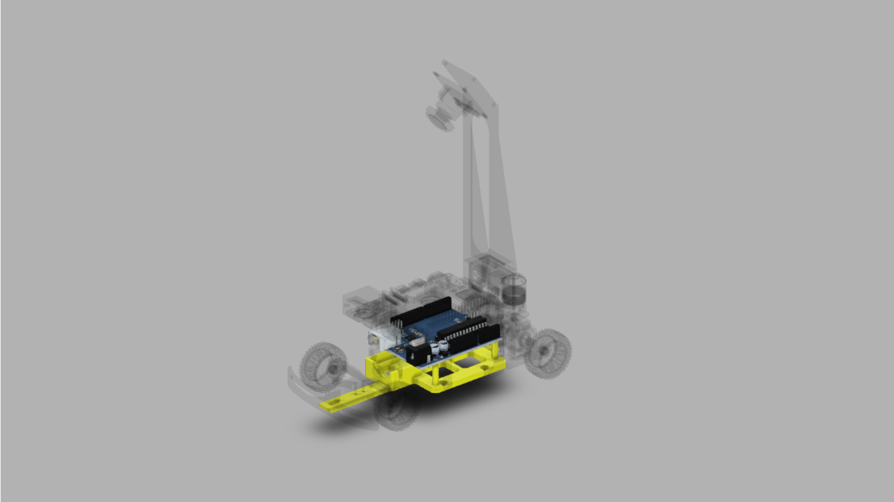

- **Connectors**: 3D printed C-shaped connectors replacing brass standoffs to speed up assembly and disassembly
    - [Connector iterations](docs/01_mechanical/mechanical_iterations.md#connectors)

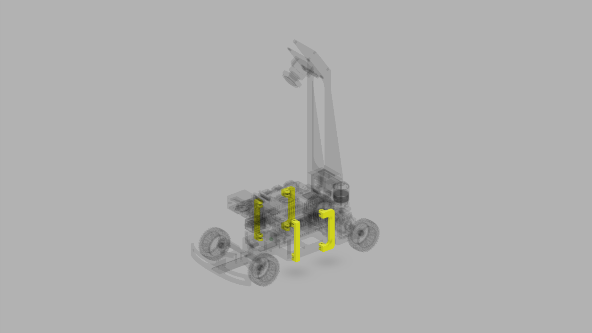

- **Furitek Micro Komodo 1212**: Brushless motor rated at 3450 KV and 120W; drives the rear wheels through the differential gearbox
    - [Motor reasoning](docs/01_mechanical/mechanical_reasoning.md#motor-selection)

- **Differential Gear System**: Custom-designed differential allowing the rear wheels to spin at different speeds during turns; went through multiple iterations before settling on an off-the-shelf gearbox

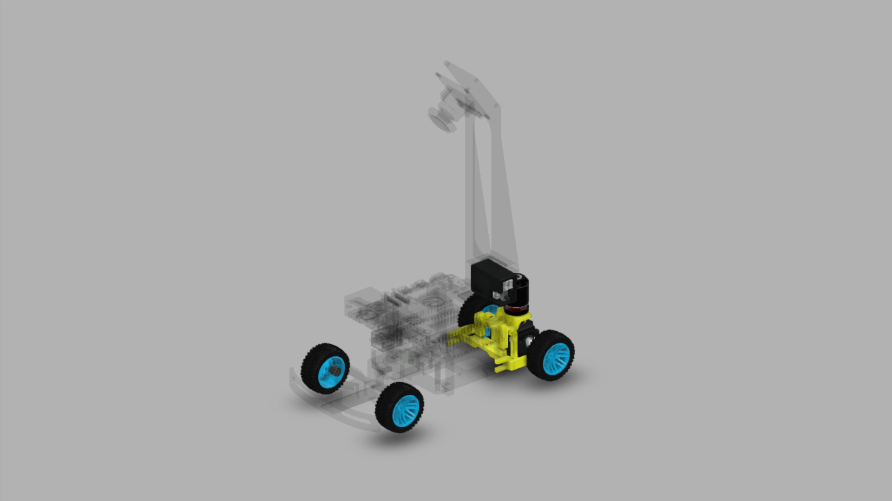

- **Wheels**: 35mm rubber wheels chosen to raise the chassis to give the differential adequate ground clearance
    - [Wheel and torque reasoning](docs/01_mechanical/torque_speed_reasoning.md)

- **Ball Bearings**: Four 6mm ball bearings pressed into the rear body mount to support the axles and reduce friction

---

### Full Robot

| | |
|:---:|:---:|
| 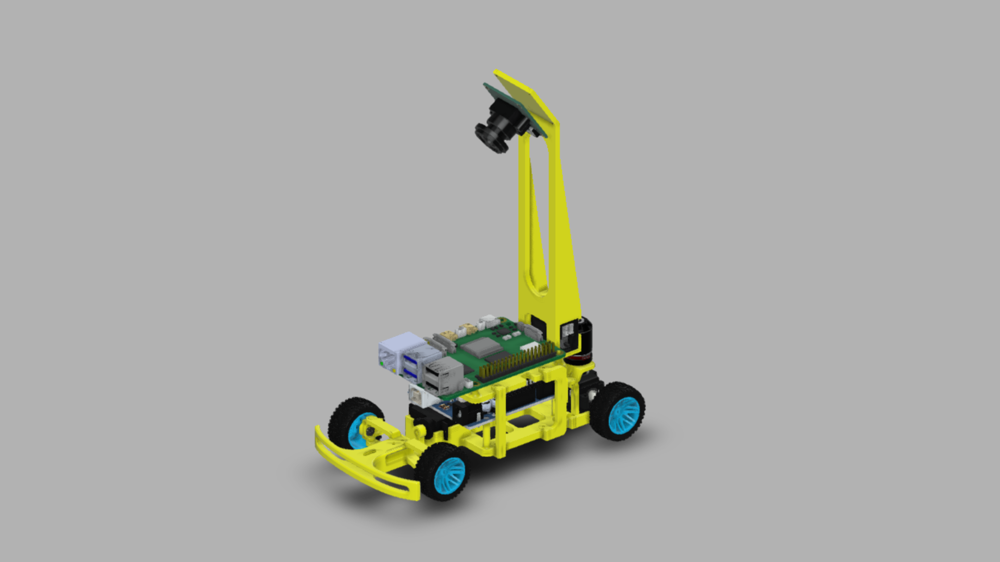 |

---

# 2. Power and Sensor Architecture
This section explains how the robot is powered, what sensors are used, where they are placed, and how they are calibrated.

### Files
- [`docs/02_power_sensors/power_architecture.md`](docs/02_power_sensors/power_architecture.md)
- [`docs/02_power_sensors/sensor_selection.md`](docs/02_power_sensors/sensor_selection.md)
- [`docs/02_power_sensors/sensor_placement.md`](docs/02_power_sensors/sensor_placement.md)
- [`docs/02_power_sensors/calibration.md`](docs/02_power_sensors/calibration.md)
- [`docs/02_power_sensors/wiring.md`](docs/02_power_sensors/wiring.md)

---


### Power

Everything starts with a single Gens Ace 1300mAh 2S LiPo battery. From there, power splits into two separate paths so the compute side and the actuator side never interfere with each other.

The first path goes through our Yahboom voltage regulator board, which steps the battery's 7.4V down to a clean 5V. That 5V feeds into the Raspberry Pi 5 through USB-C. The Arduino Uno doesn't connect to the battery at all, it gets powered straight from the Pi over a USB-B cable. The camera is also powered off the Pi, through its flat CSI ribbon cable, which carries both data and power in one connector.

The second path runs through the ESC. The ESC takes power directly from the battery and has its own built-in BEC (battery eliminator circuit) to regulate it. On the output side, the ESC's voltage pin powers the servo, and the ESC also drives the brushless motor directly since the motor doesn't need to be stepped down first.

<p align="center">
  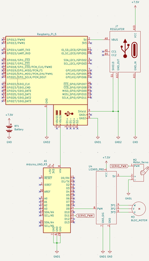
</p>
<p align="center"><i>Full electronics schematic showing power distribution and signal connections.</i></p>

The Raspberry Pi is the brain, it runs the vision pipeline, figures out where objects are, and decides what the robot should do next. The Arduino doesn't make any decisions, it just takes the drive commands the Pi sends it and turns them into precise PWM signals, since the Pi can't reliably time PWM output on its own while it's busy processing frames. The camera is the robot's only sense of the outside world, it feeds every frame the vision pipeline uses to find walls, corners, and pillars.

On the actuator side, the ESC handles throttle control for the drive motor based on the PWM signal it gets from the Arduino, and its BEC also acts as the power source for the servo, so the servo never has to touch the battery directly. The servo itself just turns the front wheels left and right based on the steering commands coming from the Arduino, and the motor is what actually moves the robot forward, spinning the rear wheels through the differential.

- **Battery**: Gens Ace 1300mAh 2S LiPo, 7.4V nominal, 45C discharge
    - [Battery details](docs/02_power_sensors/power_architecture.md#battery)
- **Voltage Regulation**: Yahboom regulator converts 7.4V to 5V for the Raspberry Pi; ESC built-in BEC powers the servo independently
    - [Regulator details](docs/02_power_sensors/power_architecture.md#design-rationale)
- **Main Power Switch**: Smaller switch installed on the main battery rail after the original 20A switch was replaced for easier integration
    - [Power design](docs/02_power_sensors/power_architecture.md#iterations)
- **Estimated Runtime**: ~17 minutes at average load; enough for ~5 full competition runs per charge

## Voltage and Current Requirements

### 5V Rail (Raspberry Pi, Arduino, Servo)

| Component | Current Draw |
|-----------|-------------|
| Raspberry Pi 5 | 2.40A |
| Arduino Uno R3 | 0.05A |
| Servo Motor (stall) | 0.70A |
| Camera (OV5647) | 0.25A |
| **Total 5V current** | **3.40A** |

Power at 5V: 3.40A × 5V = **17W**

Accounting for regulator efficiency (80%):
17W ÷ 0.8 = **21.25W** needed from battery for the 5V rail.

---

### 7.4V Rail (Motor)

| Component | Current Draw |
|-----------|-------------|
| Drive Motor (average during run) | 3.50A |
| **Total motor current** | **3.50A** |

Power at 7.4V: 3.50A × 7.4V = **25.9W**

---

### Total Battery Power and Current

| Rail | Power |
|------|-------|
| 5V rail (via regulator) | 21.25W |
| Motor rail (direct) | 25.9W |
| **Total** | **47.15W** |

Total current from battery:
47.15W ÷ 7.4V = **6.37A**

---

### Runtime Estimate

6.37A average draw from a 1300mAh (1.3Ah) battery at 80% usable capacity:

(1.3Ah × 0.8) ÷ 6.37A = **~0.16 hours (~10 minutes)**

In practice the robot lasts significantly longer because:
- The motor draws far less than stall current at competition speeds (30-40% throttle)
- The Raspberry Pi rarely hits full load simultaneously with peak motor draw
- The servo is at stall current only momentarily during sharp turns
- The regulator efficiency is typically closer to 85-90% under real load

At realistic average loads (~4A total), the expected runtime is approximately **17 minutes**, sufficient for ~5 full competition runs per charge.

Because of the decently short battery life, we have had between 4-5 batteries.


---

### Sensors

- **Camera (OV5647)**: Detects walls, corner lines, and colored pillars via CSI-2 at 640x480 up to 62.50 fps
    - [Camera selection](docs/02_power_sensors/sensor_selection.md#camera--ov5647)
    - [Camera placement](docs/02_power_sensors/sensor_placement.md)

---

### Compute

- **Raspberry Pi 5 (8GB)**: Main compute unit running the vision pipeline, control loop, and Arduino communication
    - [Raspberry Pi details](docs/02_power_sensors/sensor_selection.md#raspberry-pi-5-8gb)
- **Arduino Uno R3**: Handles PWM output to ESC and servo; receives drive commands from the Pi over USB serial
    - [Arduino details](docs/02_power_sensors/sensor_selection.md#arduino-uno-r3)

---

### Actuators

- **ESC**: Furitek Lizard Pro 30A/50A ESC
    - [ESC reasoning](docs/02_power_sensors/power_architecture.md#electronic-speed-controller)
- **Drive Motor**: Furitek Micro Komodo 1212 Stepper Motor
    - [Motor reasoning](docs/01_mechanical/mechanical_reasoning.md#motor-selectionmotor-selection)
- **Steering Motor**: HS-5055MG 11.9g Metal Gear Digital Micro Servo
    - [Steering reasoning](docs/01_mechanical/mechanical_reasoning.md#servo-motor)
---

## Risks and Mitigation

- **Voltage drop:** The 45C discharge rating minimizes voltage sag under peak current draw. Battery voltage is monitored during practice runs to identify cell degradation early.
- **Brownout:** The Pi is powered through a Yahboom voltage regulator board rather than directly from the battery, isolating it from motor-induced voltage dips. A regulator with sufficient headroom above the Pi's peak draw was selected. We may have broken one of our raspberry pi's because we forgot the regulator...
- **Electrical noise:** Motor and ESC wiring are routed away from signal wires. The serial communication lines between the Pi and Arduino are kept short.
- **Loose connectors:** All connectors are secured with heat shrink. Once, one of our wires got caught in the gear system causing damage, leading to a short circuit. All wiring has since been replaced.
- **Overheating:** The ESC and motor are mounted with airflow clearance. Competition runs are under 3 minutes, well within thermal limits. The Raspberry Pi fan is configured to always run after the temperature sensor proved unreliable on our unit.
- **Power spikes from motors / servos:** The ESC BEC powers the servo independently from the motor rail. The dedicated regulator for the Pi prevents motor spikes from reaching the compute system.

---

### Summary
- battery: Gens Ace 1300mAh 2S LiPo (7.4V, 45C)
- voltage regulation: Buck regulator for Pi (5V); ESC BEC for servo
- main sensors: OV5647 camera (CSI-2), LD19 LiDAR (USB serial)
- sensor placement strategy: Camera mounted at front with downward tilt for field of view; LiDAR mounted on top for 360-degree wall detection
- calibration approach: HSV color thresholds tuned under competition lighting using interactive tuning tools in `utils/`

---

# 3. Software Architecture and Strategy

## Software

This section explains the software that runs on the Raspberry Pi, including how the processes are structured, how the robot detects walls and obstacles, and how drive commands are sent to the Arduino.

---

## Architecture

Three processes run at the same time, camera, vision, and main control. The camera writes frames into shared memory, the vision process reads them and finds walls and obstacles, and the main process runs the state machine and sends commands to the Arduino. The system always uses the freshest data; stale frames and commands are dropped automatically.

- **Camera Process**: Captures frames and writes them into shared memory
    - [Architecture details](docs/03_software/architecture.md)
- **Vision Process**: Reads frames and finds walls and obstacles
    - [Vision details](docs/03_software/vision.md)
- **Main Process**: Runs the state machine and sends drive commands to the Arduino
    - [Runner details](docs/03_software/challenge_running.md)

<p align="center">
  
</p>
<p align="center"><i>Full software architecture diagram.</i></p>

---

## Config

All settings are stored in `piclient.toml`. Nothing is hardcoded — speed, PD gains, HSV thresholds, serial ports, and ROI sizes are all in the config file. Once the robot starts, the config is locked and cannot be changed mid-run.

- **Settings file**: `piclient.toml` at the root of the repo
    - [Config details](docs/03_software/config.md)
- **Override priority**: CLI flag > environment variable > piclient.toml > code defaults

---

## Vision

### Wall Following

`open_challenge.py:95-104` (and the "Straight" branch of `obstacle_challenge.py`): the vision pipeline finds black wall contours per frame (`vision_processing.py:126-130`) and measures each wall's pixel distance from frame-center (`get_wall_distance`). The difference between right and left distance is fed into a PD controller (`wall_follow.tick(right - left)`), and the output is sent as a steering command via `client.drive_motors(...)`. If the right wall is further than the left, the correction steers left, and vice versa. It only cares about relative position, not absolute distance, which is why the perspective transform can be skipped. Camera distortion does not change which wall is closer.

### Obstacle Detection

`vision_processing.py:100-106`: red and green pillars are found the same way as walls, but by color-thresholding the UV plane instead of the Y plane. Once a pillar is found, `get_obstacle_path_x` calculates a target x position by finding the midpoint of the gap between the obstacle and the nearest wall, then interpolates linearly toward a lookahead point ahead. A separate PD controller (`obstacle_avoid`) steers toward that target x position rather than centering between walls. This only runs in `obstacle_challenge.py`'s "Straight" state, and only when `obstacles` is non-empty. Otherwise it falls back to plain wall following.

- **Open Challenge**: Counts black pixels in left, right, and center regions. More black pixels means the wall is closer. Corner detection triggers when the center region fills up.
    - [Open challenge vision details](docs/03_software/vision.md#open-challenge)
- **Obstacle Challenge**: Finds red and green pillars using HSV color detection and calculates the gap between each pillar and the nearby wall. The midpoint of that gap becomes the steering target.
    - [Obstacle challenge vision details](docs/03_software/vision.md#obstacle-challenge)


---

## Hardware Interfaces

- **Camera**: Runs in its own process, writes frames directly into shared memory with no copying
    - [Camera details](docs/03_software/hardware_interfaces.md#camera)
- **Arduino Client**: Sends serial commands with transaction IDs so multiple commands can be in flight at once
    - [Arduino client details](docs/03_software/hardware_interfaces.md#arduino-client)
- **DriveCommandExecutor**: Sits between the control loop and the Arduino, only the latest command is sent, stale commands are thrown away
    - [DriveCommandExecutor details](docs/03_software/hardware_interfaces.md#drivecommandexecutor)

---

## Challenge Running
The robot uses a finite state machine (FSM) to decide what to do at any given moment. Each state has a specific trigger that causes the robot to enter it and a specific action it takes while in that state. The FSM runs once per camera frame, so the robot is constantly re-evaluating which state it should be in based on the latest vision data.


### Open Challenge

| State | Trigger | Action |
|-------|---------|--------|
| Straight | Default | Wall follow with PD controller |
| Turn | Black fill detected ahead | Hard steer toward missing wall |
| Final Turn | Last turn of last lap | Same as Turn |
| Final Straight | After final turn | Drive to stop |

- [Open challenge runner details](docs/03_software/challenge_running.md#open-challenge)

### Obstacle Challenge

Same as the open challenge with one extra state. When a pillar is detected, the robot steers toward the gap between the pillar and the wall. Green pillars are passed on the left, red on the right.

- [Obstacle challenge runner details](docs/03_software/challenge_running.md#obstacle-challenge)

---

## Running the Robot

```bash
wro --GeneralConfig.CHALLENGE open
wro --GeneralConfig.CHALLENGE obstacle
```

Full auto-generated API docs: https://apostla-api-reference.web.app/
---

# 4. Systems Engineering and Design Decisions
This section explains how the robot was developed as an integrated system and how trade-offs were evaluated.

- **Engineering Journal**:
The journal is best viewed on GitHub where all links are clickable. A PDF version is also available for submission.
    - [View Journal](docs/journal/CHANGELOG.md)
    - [View Journal PDF](docs/journal/CHANGELOG.pdf)

### Files
- [`docs/04_systems_engineering/subsystem_interactions.md`](docs/04_systems_engineering/subsystem_interactions.md)
- [`docs/04_systems_engineering/engineering_decisions.md`](docs/04_systems_engineering/engineering_decisions.md)
- [`docs/04_systems_engineering/constraints_tradeoffs.md`](docs/04_systems_engineering/constraints_tradeoffs.md)
- [`docs/04_systems_engineering/risk_analysis.md`](docs/04_systems_engineering/risk_analysis.md)
- [`docs/04_systems_engineering/iteration_cycles.md`](docs/04_systems_engineering/iteration_cycles.md)

### Constraints

The robot must satisfy four levels of constraints in order of priority:

- **WRO rules compliance**: Size, mass, power, and mechanical limits must be respected at all times. The robot must start, stop, and reset reliably.
- **Score maximization**: The robot must complete challenge objectives as reliably as possible, minimize recovery time, and avoid oscillations and false detections.
- **Simplicity and reliability**: Each subsystem has a clear single purpose. The system degrades gracefully under sensor noise and is easy to debug during competition setup.
- **Speed**: The camera pipeline, control loop, and serial interface must keep up with the required frame rate without creating stale-data backlogs.
    - [Full constraint tree](docs/04_systems_engineering/constraints_tradeoffs.md#constraint-tree)

---

### Trade-offs

Trade-offs are evaluated against the constraint hierarchy, a trade-off that violates a higher-level constraint is rejected regardless of its other benefits. Hardware trade-offs are treated with more caution than software trade-offs because they are harder to reverse. A quick preliminary solution is always tested on the track before committing to a final design.

- **Single camera over multiple sensors**: Reduces weight, cost, and synchronization complexity. HSV calibration and track testing address the lighting sensitivity limitation.
- **Rear-wheel drive over four-wheel drive**: Simpler drivetrain leaves more room for reliable software and testing.
- **Latest-wins command scheduling**: A fresh steering correction is more valuable than guaranteed delivery of an outdated command.
- **Namespace package architecture**: More complex to set up but provides clear interfaces, independent distribution, and sustainable long-term maintainability.
    - [Full trade-off analysis](docs/04_systems_engineering/constraints_tradeoffs.md#trade-offs)

---

### Design Iteration

Major design decisions are modelled as a Directed Acyclic Graph, early hardware choices form root nodes that constrain downstream software and tuning decisions. Two case studies show how this plays out in practice:

- **Differential gear**: Five iterations from an adapted GrabCAD design through three custom printed versions to a salvaged RC gearbox. Each iteration exposed a new constraint, material limits, tolerance stacking, component sizing, that drove the next architectural shift.
- **Python packaging**: Four iterations from a flat src directory to a namespace package architecture with independently distributable components, driven by the need for clear interfaces between the camera, vision, control, and recording subsystems.
    - [Full iteration history](docs/04_systems_engineering/iteration_cycles.md)

---

### Risk Analysis

Risks are identified through track telemetry, SPICE circuit simulation, and rulebook audits. Each risk is placed on a likelihood vs. impact matrix to prioritize fixes. Mitigation follows the same iterative process as design, a quick patch is tested on the track first, then refined into the final solution.

- **Risk lifecycle**: Identify → Evaluate → Mitigate → Validate on track → Iterate
    - [Full risk analysis](docs/04_systems_engineering/risk_analysis.md)

---

### Subsystem Interactions

The robot's performance is determined by how its subsystems work together. Key interactions:

- **Mechanical and control**: Steering range, drive speed, camera height, and PD gains must be tuned together, a software improvement is only useful if the drivetrain can produce the requested response.
- **Power and electrical**: Motor and servo current spikes can cause Raspberry Pi brownouts. The regulator and wiring separate high-current actuator loads from compute power.
- **Perception and behavior**: The camera is the only active sensor. Vision runs in a separate process and signals the main loop when fresh data is ready. Corner detection requires several consecutive frames to filter noise.
- **Software and communication**: The DriveCommandExecutor uses latest-wins scheduling so serial latency never creates a backlog of stale commands.
    - [Full subsystem interaction map](docs/04_systems_engineering/subsystem_interactions.md)

---

### Summary
- biggest engineering constraints: WRO size and mass limits; camera-only perception under variable lighting; PLA material limits for 3D printed gears
- main trade-offs: Single camera vs. multi-sensor; RWD vs. AWD; namespace packages vs. flat src; printed differential vs. off-the-shelf gearbox
- most important decisions: Latest-wins command scheduling; parallel process architecture; namespace package distribution
- major risks: Differential gear failure; Raspberry Pi brownout; camera detection failure under competition lighting
- how the robot improved through iteration: Each failure exposed a new constraint that drove the next design, five differential versions, four packaging versions, and continuous PD and HSV tuning on the track

---

# 5. Reproducibility
This section explains how another team could rebuild, set up, and test the robot.

### Files
- [`docs/05_reproducibility/build_guide.md`](docs/05_reproducibility/build_guide.md)
- [`docs/05_reproducibility/bill_of_materials.md`](docs/05_reproducibility/bill_of_materials.md)
- [`docs/05_reproducibility/setup_guide.md`](docs/05_reproducibility/setup_guide.md)
- [`docs/05_reproducibility/building_from_source.md`](docs/05_reproducibility/building_from_source.md)
- [`docs/05_reproducibility/testing_workflow.md`](docs/05_reproducibility/testing_workflow.md)

---

### Software Setup

- **Normal install**: Install the prebuilt wheel using pip on Raspberry Pi OS (64-bit, Bookworm or later)
    - [Setup guide](docs/05_reproducibility/setup_guide.md)
- **Build from source**: Clone the repo and build four namespace packages using Python 3.13+. Required if the wheel is not yet published to PyPI.
    - [Building from source](docs/05_reproducibility/building_from_source.md)
- **picamera2**: Not included in the wheel — use the system-wide installation bundled with Raspberry Pi OS. Do not install from source.

```bash
python -m venv --system-site-packages .venv
source .venv/bin/activate
pip install piclient[all]
```

---

### Hardware Setup

- **Bill of materials**: Full component list including electronics, mechanical parts, 3D printed parts, and tools
    - [Bill of materials](docs/05_reproducibility/bill_of_materials.md)
---

### Testing

- **Track is the source of truth**: No change is considered valid until tested on the real track. Unit tests and integration tests are automated via CI/CD but cannot replace real-world validation.
- **Hardware testing**: Components are tested directly on the robot. 3D printed parts are rapidly prototyped and tested. Electronics are validated in SPICE simulation before being installed.
- **Software testing**: All pull requests are automatically tested by the CI/CD pipeline. Logs and video footage are used to diagnose failures.
- **Fallback plan**: Spare parts are kept for all critical components. All packages are versioned and uploaded to PyPI for quick rollback. A fully assembled electronics backup is kept ready for competition.
    - [Testing workflow](docs/05_reproducibility/testing_workflow.md)

---

### Summary
- how to build the robot: See bill of materials and build guide
- how to install software: `pip install piclient[all]` on Raspberry Pi OS Bookworm
- how to calibrate: Run `python -m utils --tool contours control` under competition lighting and update `piclient.toml`
- how to test: Run on track — unit tests via CI/CD, real-world validation required for all changes
- what files are needed to reproduce the system: All STL files in `models/stl/`, config in `piclient.toml`, Arduino firmware in `ArudinoServer/`

## Testing and Validation
Summarize how the robot was tested.

Example points:
- bench tests for hardware
- sensor tests
- steering tests
- lane following tests
- obstacle avoidance tests
- full track tests

Detailed records:
- [`docs/04_systems_engineering/iteration_cycles.md`](docs/04_systems_engineering/iteration_cycles.md)
 - [View Journal](docs/Journal/CHANGELOG.md)

---

### Diagrams
<p align="center">
  
</p>
<p align="center"><i>Full software architecture diagram.</i></p>

<p align="center">
  
</p>
<p align="center"><i>Full electronics schematic showing power distribution and signal connections.</i></p>

### Videos
### Open Challenge Run
[](https://www.youtube.com/watch?v=WqN3tuj8LFo)

### Obstacle Challenge Run
[](https://www.youtube.com/watch?v=08cq6RNCGQM)

Suggested folders:
- `docs/images/`
- `docs/diagrams/`

---

## CAD and Wiring Files
- `cad/` – CAD files and exports
- `wiring/` – wiring diagrams and connection references

Brief notes:
- CAD software used:
- file format(s):
- wiring diagram tool used:

---

## Version History
Briefly summarize major milestones here.

See full details in:

- [`Journal`](docs/journal/CHANGELOG.md)

Example:
- **v0.1** – initial repo structure
- **v0.2** – first rolling prototype
- **v0.3** – improved steering and sensor placement
- **v0.4** – implemented lane following and obstacle response

---

## Contribution and Documentation Rules
Use this section to keep the repo organized.

Example:
- use clear commit messages
- add photos when mechanical changes are made
- document sensor changes in `sensor_placement.md`
- document tuning changes in `tuning_validation.md`
- document major engineering decisions in `engineering_decisions.md`

---

## Final Notes
This repository is intended to document not only the final robot, but also the engineering process behind it:
- design choices
- testing evidence
- failures and improvements
- reproducibility

The goal is to make the project understandable, traceable, and reproducible.
