# Differential Gear Assembly Instructions

All parts are 3D printed. Print everything before starting.

---

## Parts List

| Part | Quantity |
|------|----------|
| Crown Wheel | 1 |
| Large Gear | 2 |
| Small Gear | 2 |
| Big Spacer | 1 |
| Rotating Cage | 1 |
| Pinion | 1 |
| Rear Body Mount | 1 |
| 6mm Ball Bearing | 4 |
| T-joint Axle | 1 |
| Furitek Micro Komodo Motor | 1 |
| Screws (M2) | ~8 |

---

## `Step 1` Crown Wheel

Place the Crown Wheel flat with the bevel gear face pointing up. This is the base of the differential.

  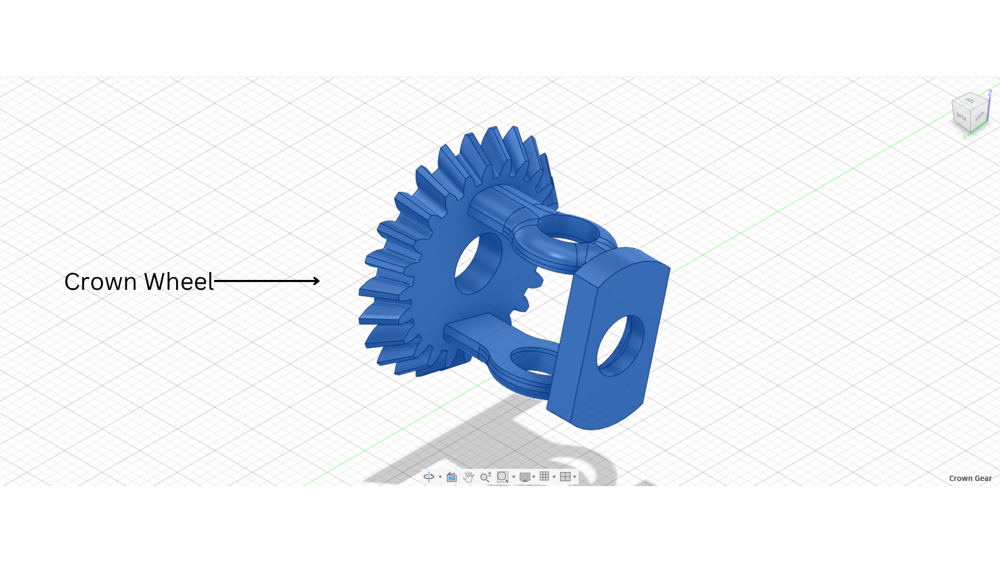

<i>Crown Wheel placed face up on work surface.</i>

---

## `Step 2` Insert Large Gears

Insert both Large Gears into the Crown Wheel. The longer shaft goes on the left, the shorter one on the right. Slide both through until seated.

  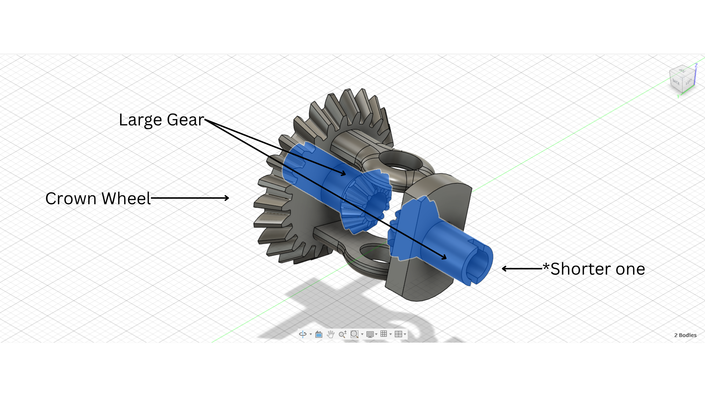

<i>Both Large Gears inserted — longer shaft on the left, shorter on the right.</i>

---

## `Step 3` Insert Small Gears

Push the Large Gears back slightly to make room, then insert the two Small Gears between them. Once in place, push the Large Gears forward to lock everything in.

  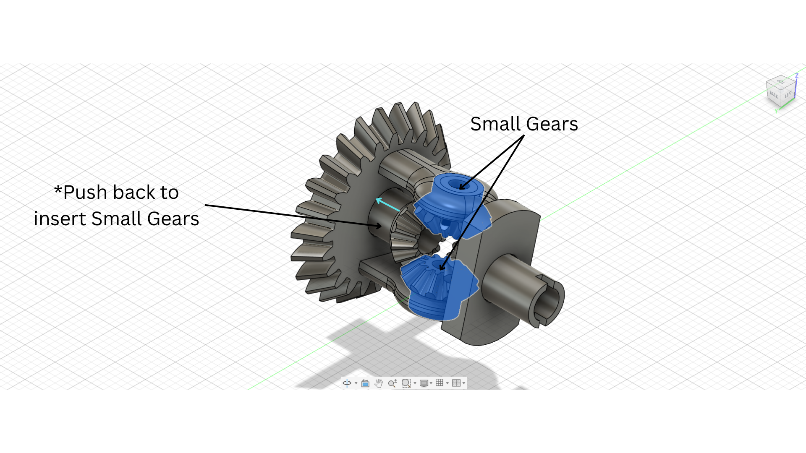

<i>Small Gears inserted between the Large Gears. Push Large Gears forward to lock.</i>

---

## `Step 4` Insert Big Spacer

Slide the Big Spacer onto the shaft from the front and push forward until it sits flush against the Crown Wheel. This holds the Small Gears in place.

  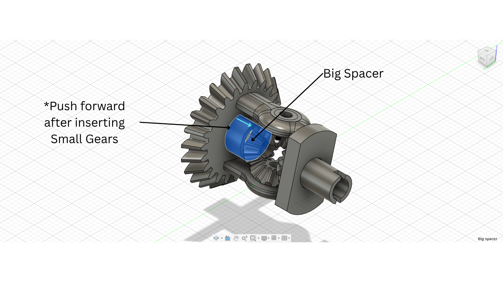

<i>Big Spacer pushed forward to secure the Small Gears.</i>

---

## `Step 5` Attach Rotating Cage

Slide both halves of the Rotating Cage onto the assembly from each side. Line up the holes and push in until fully seated.

  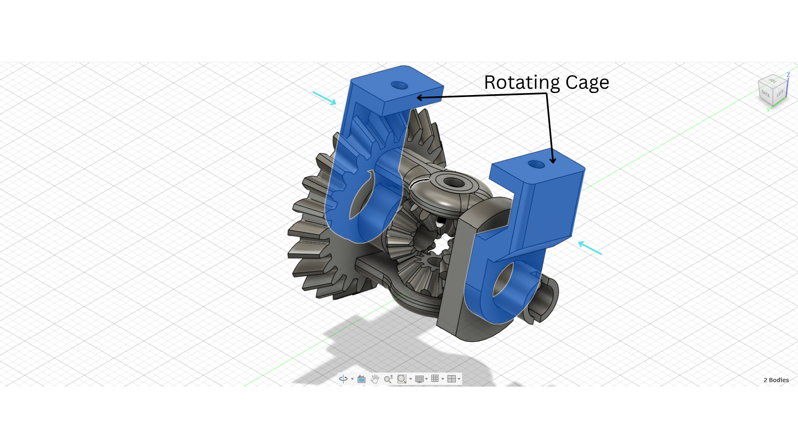
  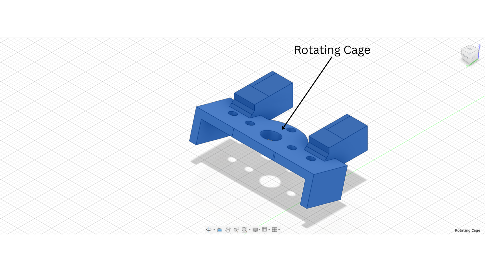

<i>Rotating Cage pressed onto both sides of the Crown Wheel assembly.</i>

---

## `Step 6` Mount the Motor

Place the motor into the mount bracket and screw in with M2 screws on both sides. The motor shaft should point down toward the Pinion position.

  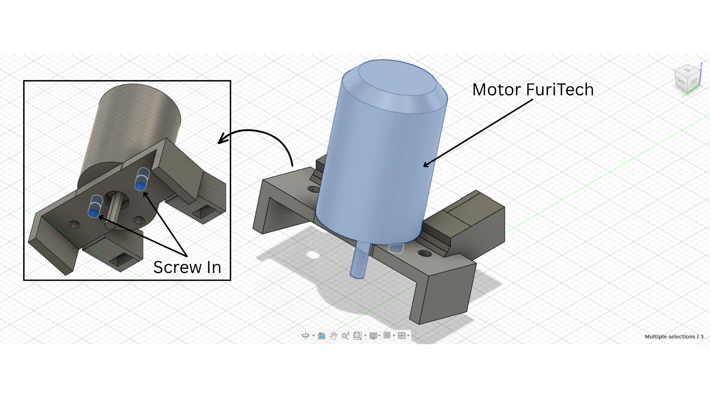

<i>Motor screwed into the mount bracket. Shaft pointing down.</i>

---

## `Step 7` Attach Pinion

Push the Pinion up onto the motor shaft from below until it meshes with the Crown Wheel teeth. Screw in through the side to secure it.

  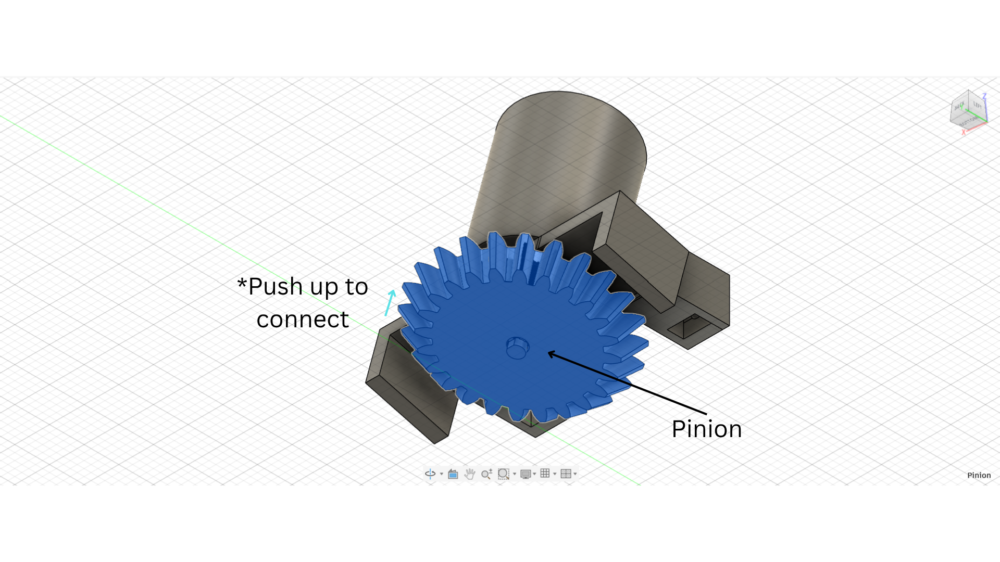
  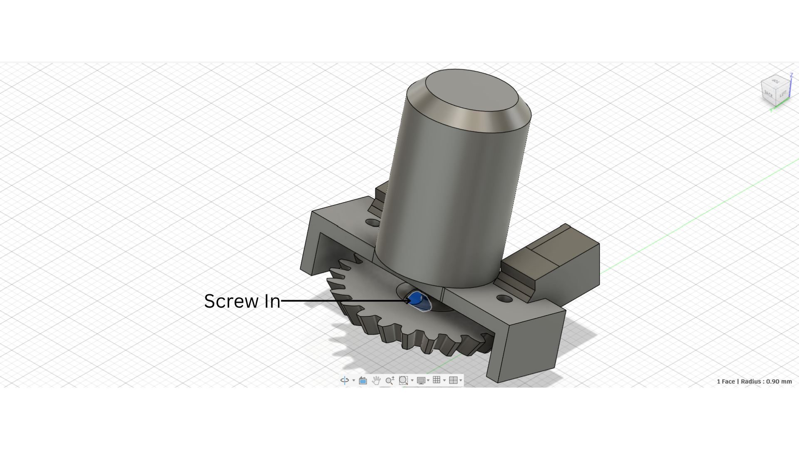

<i>Pinion pushed up onto the motor shaft and screwed in from the side.</i>

---

## `Step 8` Mount Motor Assembly to Rotating Cage

Push the motor and differential assembly down into the Rotating Cage. Line up the slots and press in until seated. Screw in through both sides.

  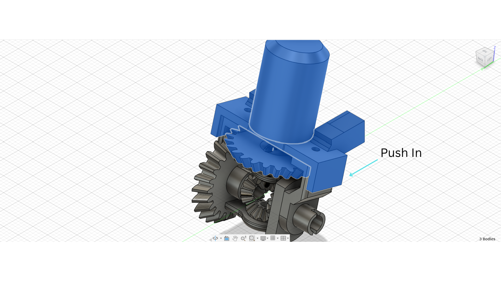
  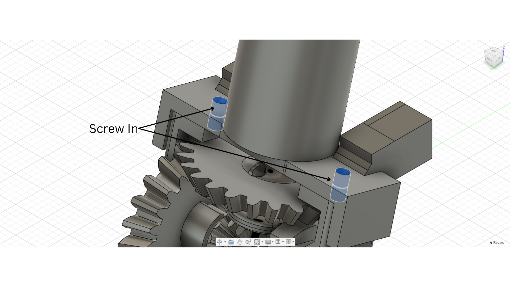

<i>Motor assembly pressed into the Rotating Cage and screwed down on both sides.</i>

---

## `Step 9` Prepare Rear Body Mount

Press four 6mm ball bearings into the bearing seats on the Rear Body Mount (two on each side). Insert the axle through each side.

  

<i>Four ball bearings pressed into the Rear Body Mount with axles inserted.</i>

---

## `Step 10` Attach Wheels

Screw the wheels onto each axle. Make sure they are tight and do not wobble.

  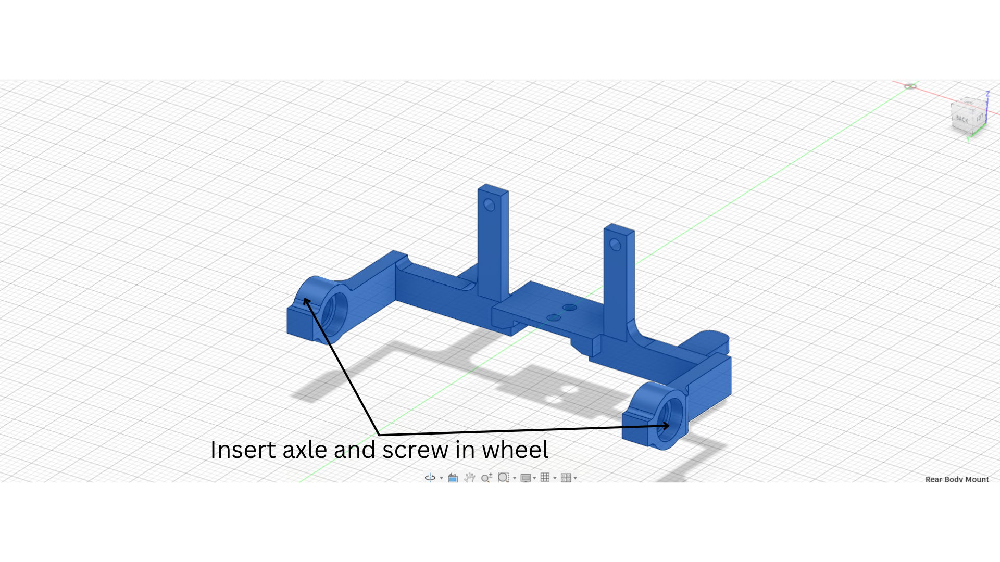

<i>Wheels screwed onto each axle.</i>

---

## `Step 11` Final Assembly

Push the full differential assembly down into the Rear Body Mount while inserting the T-joint axle through the Crown Wheel center. Screw into the Rear Body Mount through all mounting points.

  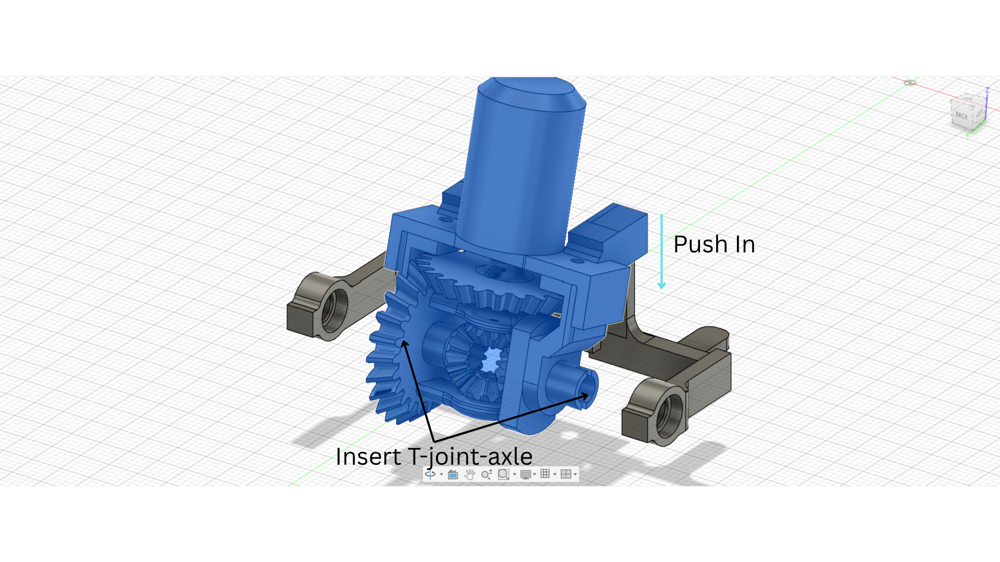
  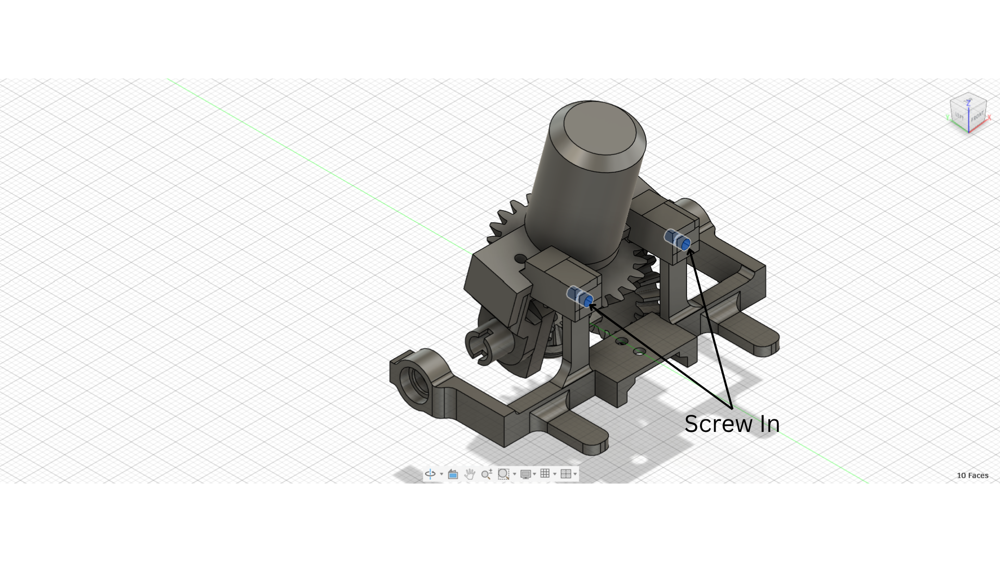

<i>T-joint axle inserted and full assembly screwed into the Rear Body Mount.</i>

---

## Check Before Installing

- Both wheels spin freely by hand.
- Holding one wheel still makes the other spin at double speed.
- No gears are skipping or binding.
- All screws are tight.

> **Note:** Do not hammer any parts together. The middle axle has broken in previous builds when too much force was used. Press by hand only.