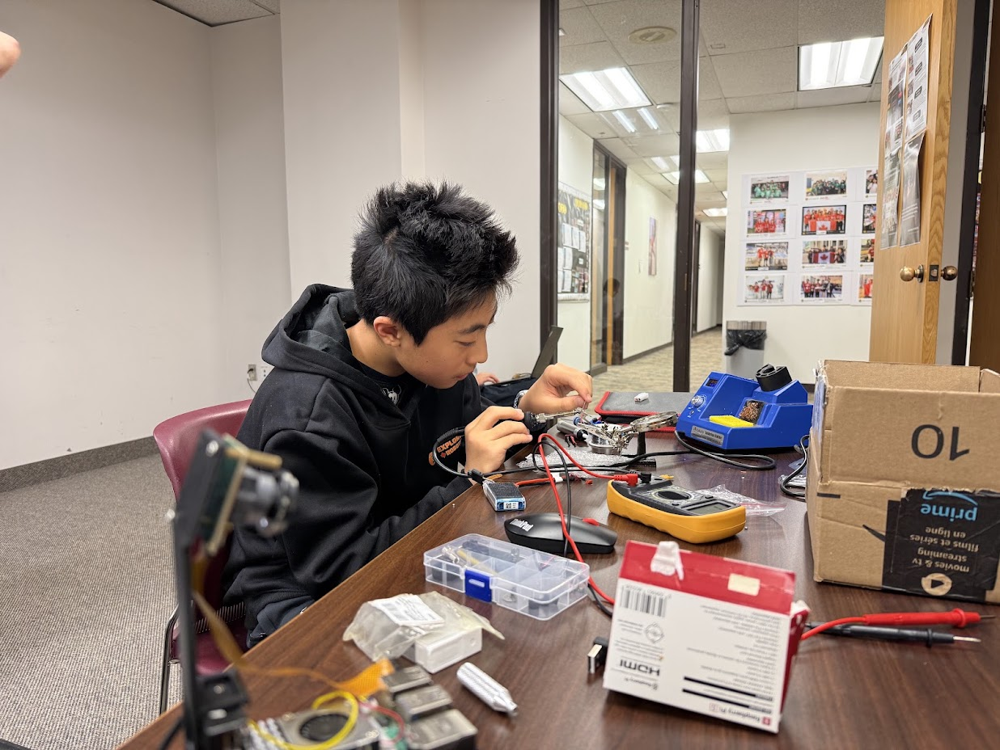
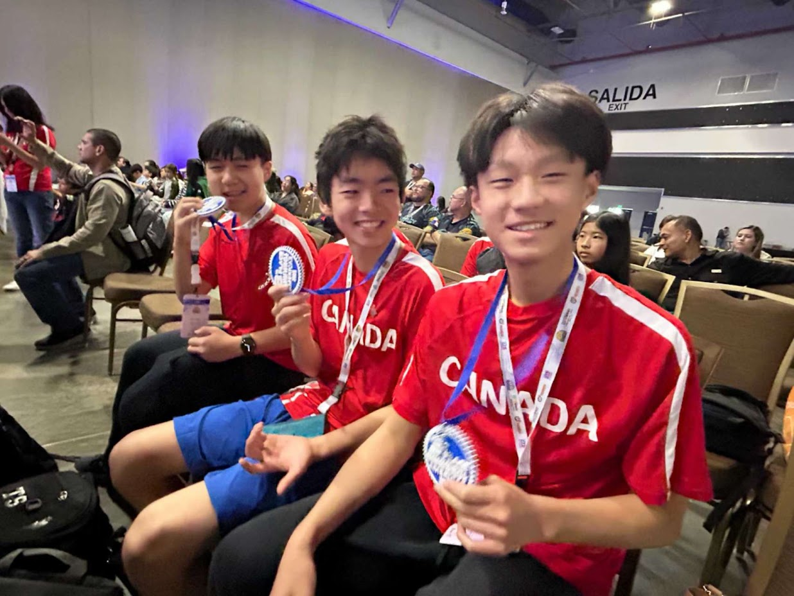

# WRO Future Engineers 2026

# Journal

## Week 1 (Dec 22–28)

- GitHub repository created.
- Async RPC implemented between PiClient and ArduinoServer.
- Async PiCamera2 wrapper created; obstacle detection and field boundary checking developed.

---

## Week 2 (Dec 29–Jan 5)

- Main file and template test file created; API documentation started.
- Multiprocessing implemented across three processes; obstacle avoidance logic built; AsyncVisionProcessor calls simplified.
- Tests directory created; camera unit tests run.

---

## Week 3 (Jan 6–12)

- Motor and servo libraries added; AsyncCamera resolution increased; CommProtocol max speed adjusted.
- AsyncCamera and VisionProcessor refactored; multiprocessing added for camera and vision.
- Shopping list added.

**Python Packaging Iterations**

| Version | Design Goals | Limitations | Takeaways |
| --- | --- | --- | --- |
| 1 | No packaging, just a single src directory with module-level imports. | Isolation of concerns suffered; architecture became tightly coupled without clear interfaces. | A single src directory is not a sustainable architecture for a project of this scope. |
| 2 | Independently maintain a simpler src_min implementation, forgoing complex multiprocessing and async IO. | The simple implementation does not meet performance constraints, and maintaining two implementations adds significant burden. | A simpler, slower implementation was a trade-off the team could not accept given latency and throughput requirements. |
| 3 | Use multiple sub-packages within a single src directory. | Architecture still tightly coupled; sub-packages not easily reusable or distributable. | Sub-packages are a step in the right direction but do not provide enough isolation of concerns. |
| 4 | Adopt a namespace package architecture with multiple sub-packages, each with distribution metadata and clearly defined exports. | Complex packaging requirements requiring deep understanding of Python packaging and distribution. | Namespace packages provide a sustainable architecture with clear interfaces and independently distributable components. |

The final namespace package architecture was adopted because the multi-process producer-consumer pipeline required clearly defined interfaces between the camera, vision processor, state machine, and hardware interfaces to avoid untraceable race conditions and shared memory allocation failures.

> For more details see [Iteration Cycles](../04_systems_engineering/iteration_cycles.md).

---

## Week 4 (Jan 13–19)

- WRO Future Engineers 2026 rules released.
- Component search began.
- Fusion 360 prototype created.

---

## Week 5 (Jan 20–26)

- First KiCad schematic draft completed.
- Footprints, symbols, and labels added to KiCad library.
- PCB routing started.
- Steering PWM fixed; vision.py entry point added.

---

## Week 6 (Jan 27–Feb 2)

- First 3D print of chassis completed.

---

## Week 7 (Feb 3–9)

- STEP file added for initial prototype.
- Logging, shared memory, and plan.md refactored.

---

## Week 8 (Feb 10–16)

- Wheels purchased.

---

## Week 9 (Feb 17–23)

- Physical robot assembly began.

---

## Week 10 (Feb 24–Mar 2)

- Servo and drive motor functioning together.
- New differential gear assembly created.
- Documentation outline created.

**Mechanical Iterations — First Versions**
The first versions of all 3D printed parts were adapted from last year's robot. Key changes made at this stage:
- Turning system reused directly; steering horn breakage identified as a recurring issue.
- RP5 layout rotated and made slimmer; camera positioned high and angled downward.
- Arduino Uno layout updated with correct mounting holes and a rectangular cutout to reduce filament.
- Connectors introduced at medium length to replace brass standoffs and speed up assembly.

> For more details see [Mechanical Iterations](../01_mechanical/mechanical_iterations.md).

---

## Week 11 (Mar 3–9)

- Online differential design failed under load.
- First custom differential failed structurally during testing.
- Second reinforced differential designed and printed.

---

## Week 12 (Mar 10–16)

- Camera error encountered.

---

## Week 13 (Mar 17–23)

- Camera error persisting.
- Multiprocessing bugs fixed; memory leak checks added.
- Project structure refactored; async vision processing implemented.
- Async vs multiprocessing architecture decision made: overlapping only helps when capture + processing time exceeds the frame interval.

---

## Week 14 (Mar 24–30)

- Camera intermittent; root cause unknown.
- Deans-T connector melted; replaced.
- First draft of open challenge code completed.
- Obstacle challenge code started.
- Arduino code reviewed; issues identified.
- General bugfix pass done.

---

## Week 15 (Mar 31–Apr 6)

- Coach flagged differential ground clearance issue.
- Coach reviewed open challenge code - [see full review](../coach_comments.md#april-15th).
- LiDAR placement under discussion.
- Camera confirmed as hardware fault - I2C error on OV5647; replacement camera borrowed.
- Off-the-shelf differential explored as backup.
- 20A power switch sourced and installed.
- Motors confirmed spinning at 30% throttle.

---

## Week 16 (Apr 7–13)

- LiDAR mount printed and installed; chassis raised to accommodate.
- Robot confirmed able to scan walls and obstacles.
- Differential middle axle broke; reprinted but still dragging on ground.
- Switched to smaller power switch.
- Voltage regulator mount created.
- Code refactored; utilities package added; coach review requested.
- Vision pipeline partially working; color thresholds need tuning.
- Camera and servo half working.

---

## Week 17 (Apr 14–20)

- Coach removed Hybrid state from open challenge; simplified to two states.
- Fixed oscillation bug between Turn and Follow Wall states using hysteresis.
- Updated and pushed open_challenge.py.

---

## Week 18 (Apr 21–27)

- Differential melted from running too fast; reprinted and upgraded.
- Reflashed SD card but still could not connect; Raspberry Pi confirmed broken.

---

## Week 19 (Apr 28–May 4)

- Differential still not working; decided to buy one if not fixed by next week.
- Voltage regulator short circuited; port broke.

---

## Week 20 (May 5–11)

- Differential fixed and working.
- Voltage regulator repair in progress.

---

## Week 21 (May 12–18)

- Fixing open challenge issues.

---

## Week 22 (May 19–25)

- Open challenge still in progress.
- Most time spent on exams.

---

## Week 23 (May 26–Jun 1)

- Primary coder left for China; difficulty navigating code through RealVNC.
- Differential broke again.

---

## Week 24 (Jun 2–8)

- PD values poorly tuned; robot crashing into inner walls.
- Lap counting still an issue.
- Open challenge completed.
- Wire to motor disconnected; re-soldered.

---

## Week 25 (Jun 9–15)

- Motor gear wearing out after 1-2 days; taped as temporary fix.
- Corner turn PD biasing proposed.
- PCB shipped to Toronto.
- Config system updated to support TOML file overrides.

---

## Week 26 (Jun 16–22)

- Vision and open challenge code updated with new tuning values; confirmed working.
- Obstacle challenge testing started; obstacles excluded during preliminary testing.

---

## Week 27 (Jun 23–29)

- Obstacle challenge code completed and ready to test.
- Test video recorded by pushing robot by hand; replay system working without needing the physical robot.
- Bug found in obstacle challenge; fix not yet identified.
- Coach noted walls need to be flipped to avoid glare affecting detection.
- VS Code extension host crashing due to Pylance using 1.7GB RAM; no easy fix.
- Bug identified: robot drives sideways despite correct steering indicator; likely a feedback loop from incorrect state entry.
- Coach found wall distances appear swapped and angle direction may be inverted in the vision output.
- Steering gimbal snapped again.
- Camera confirmed at maximum 62.50 fps at 640x480.
- Raspberry Pi Camera Module 3 Wide researched as upgrade (supports 120 fps).
- Extra battery requested from coach.

---

## Week 28 (Jun 30–Jul 6)

- Red pillar color encoding bug found (BGR/RGB mix-up); pillar detection showing progress.
- Differential dragging on the floor again.
- Decided to buy an off-the-shelf differential instead of continuing with the custom printed design.
- Team member away until Monday.

---

## Week 29 (Jul 7–13)

- Purchased differential arrived but was too large and hit the ground during testing.
- Contacted coach to source a smaller alternative rather than modifying wheels or chassis.
- Robot moving but still a little clanky.
- Checked WRO rules on robot size changes; no rule against it, but robot cannot touch the parking lot walls.
- Explored using last year's parking strategy on a different wall instead of parallel parking.

---

## Week 30 (Jul 14–20)

- Length-extending attachments cancelled.
- Coach found axle connectors too loose for differential output; lifting gearbox would cause new issues.
- Coach provided a smaller differential gearbox from an old RC kit that may fit the existing axles.
- Plan to design two 3D printed parts: gearbox mount and motor-to-shaft connector.
- Measurements and photos of gearbox taken and shared with hardware team member.
- Gearbox confirmed 22mm tall; design work started.

---

## Week 31 (Jul 21–27)

- New gearbox mount designed and printed.
- Parallel parking FSM completed.
- Fusion 360 source file requested to edit mount design; updated STEP file sent for printing.
- Checked WRO rules on parking lot stick height; no official ruling found. Coach advised proper parallel parking is required.
- Wiring broke; re-soldered.

---

## Week 32 (Jul 28–Aug 3)

- Raspberry Pi showing error code 4 long 3 short (RP1 not found); confirmed dead. Burning smell noticed days prior.
- Backup Pi picked up from coach's mailbox and set up. Fan configured to always run to prevent overheating.
- Differential no longer dragging but motor does not have enough torque; spins but cannot move the robot after sharp turns.
- Likely cause is too much gearbox friction or gears slipping under load.
- Coach suggested updating ESC speed values for the new gear ratio and calibrating the ESC using the FuriCar app.
- Speed constants already updated; camera frame rate limit of 62.5 fps is now the speed ceiling.
- Root cause of torque issue still unknown; coach suggested trying the previous motor.

---

---

## Week 33 (Aug 4–10)

- CI pipeline fixed; API reference deployments now automated and testing CI working correctly.
- API docs live at https://apostla-api-reference.web.app/index.html. TestPyPI deployment planned as next step.

---

## Week 34 (Aug 11–17)
 
- Parking lot wall following issue identified - parking lot blocks view of wall for a few seconds causing erratic behaviour. Coach suggested maintaining orientation for a fixed duration when wall is temporarily obscured.
- Steering gimbal broke again; ran out of backup parts. Requested more extras to be printed.
- Servo stopped working entirely despite correct wiring. First time this servo has failed. No backup available - looking for a fast replacement online.
---
 
## Week 35 (Aug 18–24)
 
**Mechanical Iterations — Final Versions**
- Turning system V3: curved front bumper added to allow robot to slide off walls in obstacle challenge instead of getting stuck.
- Arduino layout V3: servo moved rearward to shorten robot length; front section extended to support bumper attachment.
- Connectors V3: shortened to C-shape to keep robot compact while routing around the battery.
> For the full version history of all printed parts see [Mechanical Iterations](../01_mechanical/mechanical_iterations.md).
 
**Differential Gear Iterations (Versions 4-5)**
 
| Version | Design Goals | Limitations | Takeaways |
| --- | --- | --- | --- |
| 4 | Use a robust metal differential designed for RC cars. | The differential was too large for the universal axles, rubbed against the floor, and bent the rear assembly because of its weight. | Components cannot be viewed in isolation; they are constrained by and must be viewed in the context of the entire system. |
| 5 | Use a compact differential gearbox salvaged from a smaller RC car (1/24-1/28). | The gearbox was salvaged rather than purpose-built. No backups available, and the design is not easily reproducible. | The smaller, lighter, self-contained gearbox eliminated 3D-printed gears, reduced complexity, fit the design constraints, and allowed the robot to run smoothly. |
 
> For more details see [Iteration Cycles](../04_systems_engineering/iteration_cycles.md).
 
- Switched differential with one from an RC car (1/4 gear ratio)

---

## Week 36 (Aug 25–31)

- Servo ordered from RobotShop via Xpress Post.
- New differential gearbox confirmed working correctly.
- New servo received and picked up.
- First draft of the assembly animation completed, still rough.

---

## Week 37 (Sep 1–7)

- All new printed parts finished - assumed to be the final hardware design.
- Turning system, RP5 layout, Arduino Uno layout, and connector iterations documented and added to the repo.
- Current differential confirmed as a pre-built off-the-shelf unit.
- Voltage regulator identified - Yahboom buck converter (6V–24V to 5V/5A) designed specifically for Raspberry Pi 5.

---

## Major Problems
 
### 1. Differential Gear
 
- Online differential design failed under load ([Week 11](#week-11-mar-39))
- First custom design broke during testing ([Week 11](#week-11-mar-39))
- Middle axle broke during assembly ([Week 16](#week-16-apr-713))
- Melted from running the robot too fast ([Week 18](#week-18-apr-2127))
- Continued dragging on the ground after reprinting ([Week 16](#week-16-apr-713))
- Still not working after multiple iterations ([Week 19](#week-19-apr-28may-4))
- Fixed then broke again ([Week 20](#week-20-may-511), [Week 23](#week-23-may-26jun-1))
- Gear connecting to motor wears out after 1-2 days ([Week 25](#week-25-jun-915))
- Purchased off-the-shelf differential was too large and hit the ground; sourced a smaller gearbox from coach's old RC kit ([Week 28](#week-28-jun-30jul-6), [Week 29](#week-29-jul-713), [Week 30](#week-30-jul-1420))
- Axle connectors too loose for the differential output ([Week 30](#week-30-jul-1420))
- Axle slipping in the differential gearbox ([Week 32](#week-32-jul-28aug-3))
- Switching differential ([Week 35](#week-35-aug-1824))

The differential was the single biggest hardware headache all build. Honestly the part that got us down the most. The team started with an adapted online design which failed right away under load because the teeth didn't mesh properly. Three custom printed versions came after that, each one fixing a different problem, bad tooth shape, axle slipping, and too much friction from the 3D printing itself. After the third printed one melted from heat at high speed, we decided to just buy an off-the-shelf differential instead. The first one we bought was too big and dragged on the ground. Instead of changing the chassis, the coach found a smaller gearbox from an old RC car kit that fit our axles and had a better gear ratio, which finally fixed it and the robot ran smoothly. Every failure pushed us to a different fix, and we learned that you can't look at one part on its own, everything on the robot affects everything else. Looking back it's kind of funny that months of work came down to one small gearbox from the coach's old RC kit.
 
### 2. Camera
 
- Error persisted for three weeks ([Week 12](#week-12-mar-1016), [Week 13](#week-13-mar-1723))
- Confirmed hardware fault - I2C error on OV5647 sensor; resolved by borrowing a replacement ([Week 15](#week-15-mar-31apr-6))

The camera stopped working during testing and the cause was clear at first. We assumed it had to do something with the software or configuration. After a lot of debugging including re-seating the CSI ribbon cable multiple times, checking config.txt overlays, and re-imaging the OS with no change, we finally figured out it was a hardware fault. The dmesg output showed an I2C read error on the OV5647 sensor (error -121) and the I2C bus at address 0x36 was completely empty, confirming the sensor itself had failed. Later that week, a replacement camera was borrowed from a teammate.
 
### 3. Raspberry Pi
 
- First Pi broke for unknown reasons ([Week 18](#week-18-apr-2127))
- Second Pi broke - LED error code 4 long 3 short (RP1 not found), unknown cause ([Week 32](#week-32-jul-28aug-3))

We went through two Raspberry Pi 5 units during the build. The first failed after a connection issue that could not be resolved even after reflashing the SD card. The second showed LED error code 4 long 3 short, meaning a hardware-level failure of the main I/O chip. We noticed a burning smell days before the second failure, so it was probably caused by a power event or short circuit. Both times the coach had a backup unit available which allowed us to continue. Now the fan is configured to always run on the replacement unit to reduce the risk of thermal damage.
 
### 4. Power System
 
- Deans-T connector melted ([Week 14](#week-14-mar-2430))
- Voltage regulator short circuited; port broke ([Week 19](#week-19-apr-28may-4))
- Wiring broke and required re-soldering ([Week 31](#week-31-jul-2127))
- Servo failed completely; no backup available ([Week 34](#week-34-aug-1117))

The power system broke down a bunch of times througout the build. The Deans-T connector melted early on because of undersized wiring carrying more current than it was rated for. We later replaced all wiring with correctly rated wire after. The step-down voltage regulator later short circuited when wires were caught in the motor system, breaking the regulator port entirely. The wiring to the motor also disconnected during testing and had to be re-soldered. Also, late in the build the servo motor failed completely for the first time, with no clear cause. We ordered a replacement via express shipping and it arrived within a few days.
 
### 5. Open Challenge Code
 
- Unnecessary Hybrid state and oscillation bug between Turn and Follow Wall states ([Week 17](#week-17-apr-1420))
- PD values poorly tuned; robot crashed into inner walls ([Week 24](#week-24-jun-28))
- Lap counting issues ([Week 24](#week-24-jun-28))

The first version of the open challenge code had a Hybrid state on top of Follow Wall and Turn, which was intended to handle the transition zone at corners. Our coach said it was unnecessary and pointed out it created 6 possible state transitions instead of 2, making the logic much harder to debug. We then removed and replaced it with a simpler two-state machine using hysteresis to prevent oscillation between states. The PD tuning proved difficult without consistent hardware and the robot frequently crashed into inner walls when switching states because the gains were set too aggressively. Lap counting was also unreliable because single-frame detections of the corner line were being counted multiple times. These issues were resolved through careful tuning on the track over several weeks.
 
### 6. Obstacle Challenge
 
- Robot driving sideways despite correct steering indicator ([Week 27](#week-27-jun-2329))
- Wall distances appearing swapped in vision output ([Week 27](#week-27-jun-2329))
- Color encoding bug causing wrong pillar colors in replay ([Week 28](#week-28-jun-30jul-6))
- Steering gimbal broke multiple times ([Week 27](#week-27-jun-2329), [Week 34](#week-34-aug-1117))

Working on the obstacle challenge turned up a bunch of bugs that would've been almost impossible to find without the replay system. The robot was driving sideways even though the steering indicator showed it going straight, which the coach figured out meant the left and right wall distances were swapped in the vision output, so the robot was steering the wrong way without knowing it. There was also a color bug where red pillars showed up as the wrong color in the replay because of a BGR/RGB mix-up in the code. The steering gimbal kept breaking from the sharp corrections during obstacle avoidance, so we had to reprint it more than once. We worked through all of it using the video replay system, which let us figure out problems without needing the actual robot running. This was probably the most confusing stretch of debugging all year, none of the robot's behavior made sense until the replay let us actually see what the vision was doing.
 
---
 
# Reflection
 
## What Could Have Been Done Better
 
### Hardware
 
We should have started with an off-the-shelf differential from the very beginning, because five rounds of printing our own cost us months of build time we didn't need to lose. The PLA material limits were a risk we should have seen coming a lot earlier than we did. We also should have kept more spare parts on hand from the start, since running out of steering gimbals and having no backup servo during important testing weeks cost us a lot of time we couldn't get back. Better cable management and strain relief from day one would have stopped the melted connector, the short-circuited regulator, and the motor wire coming loose. We also should have tested each component on its own before putting it all together, since the camera issue dragged on for three weeks partly because we didn't isolate it fast enough.
 
### Software
 
The codebase got over-engineered early on with async processing, multiprocessing, and shared memory before we even had basic wall-following working reliably, and getting something simple working first would have saved us a lot of debugging time later. HSV threshold tuning should have been standardized much earlier with a proper tool and documented values instead of being redone informally almost every session. The obstacle challenge also got started too late compared to the competition timeline, which left us without enough time to actually test and tune it properly.
 
### Process
 
We needed more track time earlier on, since a lot of our biggest issues, like PD tuning, lap counting, and state machine bugs, only ever showed up during real runs and took weeks to fix because we didn't have enough access to a track. Relying so heavily on one person to understand the code was a risk that caught up with us the moment Michael left for China. Ryan and Elvis ended up spending an entire four hour class period just trying to figure out how to even connect to the robot and make a basic code change, since Michael had always been the one handling that part and nobody else really knew the process. If we had shared that knowledge across the whole team earlier, that day alone would have taken twenty minutes instead of four hours.
 
---
 
## Future Improvements
 
### Hardware
 
We want to replace the OV5647 camera with the Raspberry Pi Camera Module 3 Wide, since its higher resolution and 120fps would give the vision pipeline a lot more headroom, especially for the obstacle challenge at higher speeds. We'd also like to design a proper PCB for power distribution instead of relying on point-to-point wiring, which would cut down on failure points and make the electronics a lot more compact and reliable. The LD19 LiDAR is already wired up and parsing data but was never actually connected to the control loop, so integrating it into the challenge runners would make wall following a lot more reliable than counting pixels under lighting that keeps changing. We also want to design a proper Ackermann steering geometry to get rid of the tire scrub we get during turns, which should improve how accurately the robot follows its path at higher speeds.
 
### Software
 
We want to build adaptive HSV thresholds that adjust to the lighting automatically instead of needing to be recalibrated by hand before every run. Adding odometry or dead-reckoning using encoder feedback or IMU data would also help lap counting be more reliable and take some of the pressure off relying on vision alone. We still need to finish the parallel parking implementation for the obstacle challenge. We'd also like to properly publish the piclient package to PyPI so setup is just a single pip install instead of needing to build from source every time. Expanding the test suite with more integration tests using recorded video would also let us validate software changes without needing physical track time for every little check.
 
### Process
 
We want to start hardware iteration earlier and run it alongside software development instead of doing them one after the other. We also want to keep a shared calibration log so HSV values and PD gains from each session are actually written down and easy to compare over time instead of living in someone's head. Most importantly, we want to cross-train everyone on both hardware and software so we never end up in a situation like the one after Michael left, where Ryan and Elvis lost a whole class period just trying to figure out how to connect to the robot and push a code change.
 
---
 
## what did we learn?
 
Getting a simple solution working first matters more than building something complicated. We spent a lot of time on a complex pipeline before the basic wall-following was even reliable, and that cost us weeks we could have spent testing.
 
When Michael left for China during late June, Ryan and Elvis sat down to make what should have been a quick code change and ended up spending an entire four hour class just trying to figure out how to even connect to the robot in the first place. Michael had always been the one who handled that side of things, so nobody else really knew the steps. A team where only one person understands the code is a team with a single point of failure, and that class was proof of it.
 
Looking back at the whole build, it definitely wasn't a straight line. Some weeks we felt like we were almost done, other weeks it felt like everything that could break just did.

---

**Heres a photo of Michael hard at work**

  

**Heres a photo of Ryan, Elvis, and our previous teammate last year**

  

## Elvis:
 I had an amazing experience working alongside such intellectual and driven peers. This season has probably been my favorite out of the past few. Being surrounded by people who were always willing to share ideas, challenge each other, and help when things got difficult made the experience especially rewarding. I learned a lot from seeing how different people approached problems and worked through challenges.

I also feel that I grew a lot throughout the season, both technically and as a teammate. There were definitely moments where things did not go as planned, but learning how to stay patient, adapt, and work together made those moments some of the most valuable. Looking back, I am really grateful for the people I got to work with and the experiences we shared. This season gave me a lot of memories that I will carry into future seasons. 

I care about Future Engineer because it has taught me so much about engineering while bringing me closer to many incredibly smart and amazing peers who share the same passion.

## Ryan:
